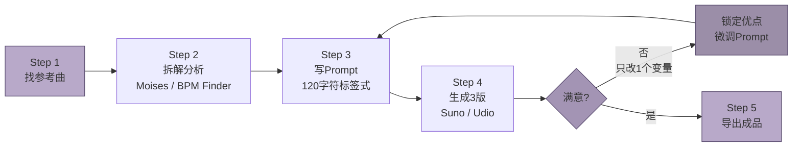

## 2. 小白AI创作五步法：总览与心理建设

读完第1章的术语清单，你已经知道了BPM、Key、Chord这些"密码"是什么意思。现在的问题是：怎么把它们串成一条能走的路？本章给你一个完整的路线图——不是 vague 的"多试试"，而是每一步该打开哪个网页、输入什么、花多长时间的精确导航。更重要的是，我们先解决心态问题，因为数据表明，放弃AI音乐创作的人里，大多数不是败在技术，而是败在"第3版不好听就关了网页"。

### 2.1 五步法总览

AI音乐创作可以被压缩为五个连续动作，形成一个可循环的工作流。

**Step 1：找参考曲。** 打开网易云音乐或Spotify，找到一首"我想要这种氛围"的歌。重点是提取可量化的DNA，而非复制整首作品。

**Step 2：拆解分析。** 用Moises（2024年苹果iPad年度应用，5000万+用户）上传歌曲，约90秒输出Key、BPM、和弦进行和音轨分离 [^323^][^150^]。零成本替代方案：BPM Finder查Key/BPM（浏览器本地处理，完全免费，不上传服务器）[^67^] + FindTheChords.com获取和弦 [^235^]。拆解目标是得到一组参数，例如"C Major, 120 BPM, I-V-vi-IV"。

**Step 3：写Prompt。** Suno使用逗号分隔的标签式Prompt（Tag-list），Udio使用自然语言描述式Prompt [^95^]。初学者推荐Suno的120字符短Prompt discipline——控制在这个长度内，强制你只保留最关键元素 [^293^]。核心四要素按优先级排列：Genre（风格，必须放Prompt最开头，AI对前5-10词赋予最高权重）、Mood（情绪）、Instrumentation（乐器）、Vocal（人声）[^77^][^45^]。然后用Meta Tags标注结构：`[Verse]`、`[Chorus]`、`[Bridge]`——这些标签是告诉AI"这里能量该上升"的元指令 [^42^]。

**Step 4：批量生成3版。** 同一Prompt点击生成3次。AI内置随机性，三次输出可能像三首不同Demo。评估维度：结构清晰度、Hook抓耳度、能量流动、是否想再听一遍。

**Step 5：迭代优化。** 选中3版中最有潜力的一版，只改一个变量再生成。可能是把BPM从120调到110，可能是把"bright"换成"breathy"，也可能是给Chorus加 `(belted, powerful)` [^45^]。纪律是：一次只改一个变量，否则你永远不知道是什么在起作用 [^218^]。不满意回Step 3，满意就导出。

流程图里的循环箭头是精髓：AI音乐创作不是线性过程，而是"生成→评估→微调→再生成"的螺旋上升。你循环得越多，对Prompt的控制力就越强。

### 2.2 关键心态

技术步骤容易学，心态却常在第三版生成后击溃你。以下是两条数据验证过的心态法则。

**"生成10版选最好的"法则。** 研究显示，专业AI音乐创作者平均进行7-12轮迭代才满意，小白用户通常在第1-2轮就放弃 [^218^]。这个"迭代差距"——而非工具差距——是区分可发布作品和废弃Demo的核心变量。把"生成"看作摄影连拍：不是每下快门都要出大片，而是通过数量堆出质量。AI的随机性是优势——第7版里那个意外的和弦走向，有时比你最初设想的更好。纪律是：每版做笔记，"这版鼓点好，那版旋律好"，把好的元素拼进下一版。

**"解构而非模仿"原则。** 当你说"我想要Taylor Swift那样的歌"，真正要做的是提取Style DNA：现代流行叙事 + 明亮原声吉他 + 亲密主歌 + 大能量副歌 + 干净制作 [^91^]。直接命名艺术家在多数平台会被过滤或导致结果不可靠。正确做法是用Moises拆解参考曲的参数（速度、调性、情绪、乐器组合），然后在Prompt里重新组合。你是在用参考曲的"建筑材料"盖新房子，而不是复印它的"图纸"。

### 2.3 时间投入预期

很多人放弃的原因是时间预期失真——以为点一下按钮就能出金曲，第一版像噪音，于是下结论"AI音乐骗人"。以下是基于处理速度和迭代轮次的真实时间线。

| 创作阶段 | 第一首歌 | 第十首歌 | 变化原因 |
|---------|---------|---------|---------|
| 找参考曲 | 20分钟 | 5分钟 | 从漫无目的到精准定位 |
| 拆解分析 | 30分钟 | 10分钟 | Moises操作从陌生到熟练 |
| 写Prompt | 40分钟 | 8分钟 | 从纠结措辞到条件反射 |
| 生成3版+评估 | 15分钟 | 8分钟 | 平台操作熟练+审美加速 |
| 迭代优化 | 60-120分钟 | 10分钟 | 从大海捞针到精准微调 |
| **总计** | **约2.5-4小时** | **约30分钟** | **肌肉记忆+Prompt库积累** |

第一首歌的2.5-4小时包含了学习工具界面、理解Prompt语法、熟悉Meta Tags的初始成本。Moises处理一首3分钟歌曲约90秒，但加上反复确认参数、对照术语理解含义，首次30分钟是正常投入 [^27^]。写Prompt耗时最长，因为你要在"想表达的感觉"和"AI能理解的标签"之间反复翻译——这正是"AI音乐素养"的核心缺口所在 [^283^]。

第十首歌30分钟的前提是你建立了个人Prompt模板库。写过3首Synth-Pop后，你拥有验证过的骨架：`synth-pop, [BPM] BPM, [Key], bright female vocals, shimmering arpeggios, [Mood]`。新创作时只替换BPM、Key和Mood三个变量，8秒完成Prompt撰写。

时间线还揭示一个反直觉事实：迭代优化在第一首歌吞噬最多时间（60-120分钟），但在第十首歌压缩到10分钟。这不是敷衍，而是你学会了"听出问题→定位Prompt变量→一次修复"的闭环。当你能听出"副歌能量不够"并立刻知道该加 `[Build]` 标签或把 `(belted)` 放进Chorus时，迭代就从试错变成了调校 [^223^]。每周投入2小时，第一个月可完成6-8首完整歌曲，积累覆盖3-4种风格的个人Prompt库。第二个月起，每首歌的边际时间成本陡峭下降，瓶颈不再是"怎么写Prompt"，而是"想写什么"。
