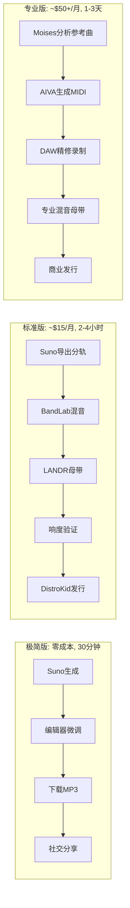

## 8. 进阶工作流：从AI demo到专业作品

前面的章节已经帮你掌握了单点技能：选工具、写Prompt、改歌词、懂版权。但把这些技能串成一条从“AI生成”到“正式发布”的完整流水线，需要一张清晰的路线图。本章提供三种不同复杂度的工作流——你不需要一步到位，而是根据自己的时间、预算和技术储备，选择今天就能启动的那一条。同时，针对中国用户的网络环境、支付方式和发行平台，单独给出三条本土化路径。

### 8.1 三种复杂度工作流

工作流（Workflow）是指将创作任务按顺序串联起来的操作管线。以下是2025-2026年经过社区验证的三种典型模式。

#### 8.1.1 极简版（纯AI，零成本）：Suno生成 → 直接导出MP3分享

核心哲学是“不碰DAW”——所有操作在浏览器或手机内完成。适用场景：生日歌、播客配乐、短视频BGM。

操作四步走：打开Suno免费版（50积分/天，约可生成10首）[^551^]，用Simple Mode输入风格描述，等待30秒获得两首变体。在Suno Song Editor内做简单编辑——Replace Section换段落、Extend延长副歌、Fade Tags加淡入淡出[^35^]。下载MP3，直接上传到微信、抖音或B站。

隐性成本是质量天花板：免费版有水印、动态范围偏窄、响度不统一。但对于非正式分享，这些缺陷几乎不可感知。偶尔需要分离人声或伴奏时，Moises免费版每月支持5首歌的Stem分离[^25^]。

#### 8.1.2 标准版（AI+DAW，推荐）：Suno导出WAV → BandLab编排 → LANDR母带 → 发布

这是大多数认真创作者的最佳“甜点区”（Sweet Spot）。

第一步，在Suno Pro中用Custom Mode生成3-5个版本，导出前在Studio中切换Manual BPM Lock，防止AI的微速度漂移导致DAW对齐困难[^10^]。然后导出WAV分轨——Suno V5最多支持12轨分离，包括人声、鼓组、贝斯、吉他、合成器等[^8^]。

第二步将分轨导入BandLab。这款完全免费的浏览器DAW支持导入WAV后添加EQ、压缩、混响[^1^]。核心混音操作可在30分钟完成：削减200-400Hz浑浊频段，10kHz以上轻微提升增加“空气感”，Master Bus上加轻柔压缩（比率1.5:1）[^19^]。

第三步用LANDR做AI母带。LANDR在2025年7月472人盲测中被评为AI母带最佳表现[^10^]，$11.99/月Starter计划提供无限母带，支持Warm/Balanced/Open三种风格[^3^]。关键技巧：给AI母带留出-10dB到-6dB的峰值余量（headroom），否则输出会被过度压缩[^10^]。

第四步用免费的Youlean Loudness Meter 2验证响度：Spotify/YouTube目标-14 LUFS，Apple Music目标-16 LUFS，True Peak低于-1 dBTP[^2^][^6^]。通过后即可导出16-bit/44.1kHz WAV，通过DistroKid发行全球[^421^]。

#### 8.1.3 专业版（全控制）：参考曲Moises分轨 → AIVA MIDI导出 → DAW真人录制 → 专业混音母带

面向需要完整版权控制的专业制作人。

先用Moises分离参考曲目的4-8轨，分析其结构、和弦进行和频率分布[^21^]。然后在AIVA中生成MIDI草稿——AIVA的核心优势是MIDI-first架构，每种乐器单独成轨，可在任意DAW钢琴卷帘中进行音符级精修[^11^][^13^]。AIVA Pro计划（约€49/月）授予生成MIDI的完整版权所有权[^11^]。

将精修后的MIDI导入DAW，加载专业音源，录制真人演唱和乐器。混音阶段使用多段压缩和M/S EQ，最终通过iZotope Ozone Advanced完成母带[^5^]。这条路径的哲学是“AI加速而非替代人类制作”——保留AI的和弦框架，逐步替换为真人演奏，每次替换都让作品更接近人类制作感[^8^]。

**图8-1：三种工作流对比**

三条路径的分野节点清晰可见：极简版和标准版的差异在于“是否进入DAW”，这一步决定了你能否调整音量平衡和统一响度标准。标准版和专业版的差异在于“是否使用MIDI中间层”——MIDI导出意味着可以替换每一个音符和音色，而音频分轨只能调整已有声音的音量和EQ。对于从第1-6章学过来的读者，标准版是投入产出比最高的选择。

### 8.2 中国用户特别路径

国际工具链对中国用户存在三重门槛：网络访问（需翻墙）、支付（需国际信用卡）、发行合规（2025年9月起AI内容强制标识）。以下三条路径根据你的技术能力和风险偏好设计。

| 路径 | 核心工具链 | 月成本 | 翻墙需求 | 主要优势 | 关键限制 |
|------|-----------|--------|---------|---------|---------|
| **无需翻墙** | 网易天音/海绵音乐 → 剪映 → 网易云/汽水音乐 | ¥0 | 无需 | 全中文界面；微信生态；直接提现到支付宝 | 平台不主动推流；收益微薄[^37^] |
| **技术用户** | DiffRhythm本地部署 → ACE Studio人声 → 剪映 → 抖音/快手 | ¥0 | 无需 | 完全可控；开源免费；中文歌声顶尖[^35^][^33^] | 需8GB+显存；部署有技术门槛 |
| **国际发行** | 虚拟信用卡订阅Udio → 人类再创作 → DistroKid全球发行 | $30-50 | 需要 | UMG/WMG授权清洁；覆盖150+平台[^91^] | 虚拟信用卡风险；需持续翻墙 |

#### 8.2.1 无需翻墙路径：网易天音/海绵音乐生成 → 网易云音乐/汽水音乐发布 → 平台激励金

网易天音微信小程序是真正的“打开即用”：输入祝福对象和祝福语，10秒即可生成歌曲[^1^][^3^]。2024年5月Web端开放后增加了专业级词曲编唱全流程能力。海绵音乐则针对中文人声优化，减少电音、提升吐字清晰度[^8^]。

发布端，网易云音乐于2025年12月上线AI歌曲专属激励金，2026年3月将提现门槛从1000元降至100元，已吸引近60万首AI歌曲参与[^25^]。汽水音乐对AI音乐有基础播放分成（千次播放约0.8-1.5元），并推出“汽水AI音乐创作实验室”[^27^]。

这条路径的最大优势是“零摩擦”——生成、发布、提现全部在中文生态内闭环完成。但创作者反馈平台一般不主动给AI歌曲推流，收益微薄甚至需自己贴钱买流量[^37^]。建议将其视为技能练兵场而非稳定收入来源。

#### 8.2.2 技术用户路径：DiffRhythm本地部署 → ACE Studio人声 → 剪映配视频 → 抖音/快手发布

DiffRhythm由西北工业大学与港中文联合开发，最低仅需8GB显存，10秒可生成4分45秒的完整双轨歌曲[^35^]。B站有大量中文一键整合包教程[^19^]。人声部分使用ACE Studio，它拥有80+免费可商用AI歌手，支持声线混音和AI合唱[^33^]。Fish Speech V1.5的中文字符错误率仅1.3%，可作精细中文语音合成补充[^34^]。

视频制作使用剪映专业版，其“闪避”功能可智能根据人声大小自动调节BGM音量[^12^]。唯一硬性门槛是显卡——8GB显存为DiffRhythm最低要求。

#### 8.2.3 国际发行路径：虚拟信用卡订阅Udio → 人类再创作 → DistroKid发行全球

Udio与UMG、WMG、Merlin和Kobalt均达成授权协议，版权基础最清洁[^91^][^389^]。但中国用户需解决访问和支付：Udio在中国大陆需VPN[^16^]，订阅需国际信用卡[^15^]。可行方案是虚拟信用卡（如WildCard，支持支付宝充值）[^17^]。

订阅后在Udio生成歌曲，导出分轨到DAW叠加真人录制（确保人类创作占比超30%，以符合中国国家版权局区块链存证要求[^491^]），最后通过DistroKid（$22.99/年）发行到全球150+平台[^421^]。这条路径法律安全性最高，但年综合成本约$500-600。建议确认作品质量达到发行标准后再选择此路径。

### 8.3 持续精进资源

#### 8.3.1 今天开始：Suno官方Discord、r/SunoAI、B站“AI音乐教程”

Suno官方Discord拥有约40万成员，团队直接参与社区互动[^653^]。r/SunoAI约10万成员，社区产出大量实战经验帖和Prompt模板[^507^]。中文用户优先关注B站：UP主“Suno教学”的V5.5教程获215.8万播放[^514^]，15分钟精通教程BV1mJ4m1G7T1覆盖从入门到AI协同创作MV的完整工作流[^509^]。这些视频的特点是跟着做就能出结果。

#### 8.3.2 本周进阶：Tunesona Prompt博客、AvenueAR Suno指南、Moises教程系列

Tunesona的Suno V5.5教程详细讲解Voices、Custom Models和My Taste三大新功能[^531^]。Jack Righteous的Metatags综合指南包含12个类别的标签说明和可直接复制的实战模板[^663^]，其Suno初学者指南强调“生成几个版本→选择最佳→改进”的迭代哲学[^532^]。Moises官方帮助中心提供从分轨分离到和弦检测的完整教程[^21^]——掌握Moises意味着你能拆解任何参考曲目，分析它的调性、速度和和弦进行。

#### 8.3.3 长期提升：Sound on Sound杂志、Jack Righteous完整指南、HookTheory和弦理论

Sound on Sound杂志的AI态度调查覆盖近1200名职业音乐人，超过70%拥有十年以上经验[^742^]。阅读专业媒体的AI报道能帮你建立行业级判断力。Jack Righteous的《From Text to Track》电子书（$2.99）涵盖从创意到变现的完整路径，含200多个Prompt和模板[^731^]。HookTheory的和弦分析工具结合Chordify实时和弦图谱[^298^]，能帮你从“AI给我什么就用什么”进化到“我知道这个和弦为什么在这里”。
