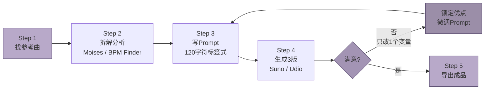
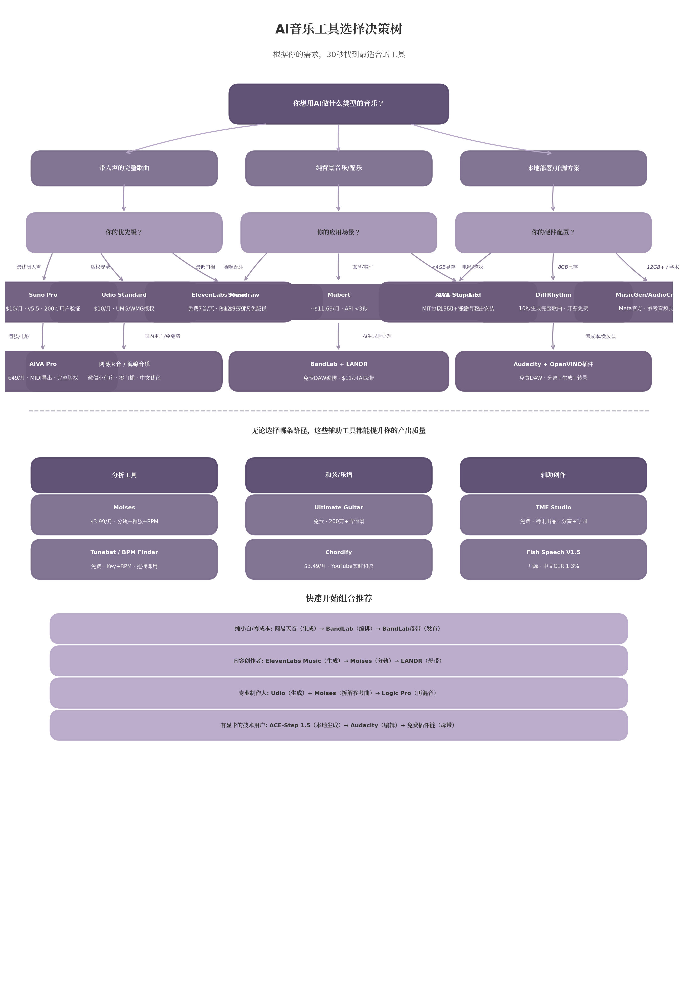
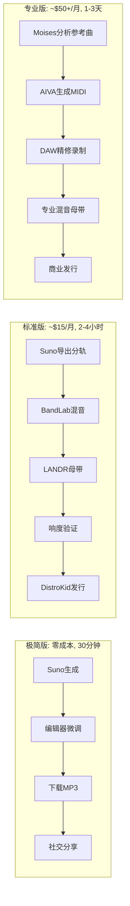

## 1. 核心术语速查表：音乐小白必须知道的15个词

音乐理论不是创作门槛，而是控制AI的遥控器。本章将15个核心术语按三个维度分类，每个词配备简化解释、生活类比、以及在Suno和Udio Prompt中的精确写法。读完本章，你可以直接复制表格里的Prompt片段去生成第一首歌。

---

### 1.1 速度、调性与结构

#### 1.1.1 BPM（每分钟节拍数，Beats Per Minute）

BPM是衡量音乐速度快慢的数字指标，就像心跳频率——正常心跳每分钟60-100次，音乐同理：每分钟有多少个基本节拍，就是多少BPM。[^278^] 标着120 BPM的歌，意味着每分钟120拍，约每秒钟敲两下桌子。

但对AI创作来说，BPM不是数字，是“感觉”。同样是140 BPM，Trap把Kick放在第1拍、Snare放在第3拍，Hi-hat以全速140运行，实际律动只有70 BPM的“半速感”（Half-Time）。[^41^] 摇滚的140 BPM则是Kick在1和3、Snare在2和4，听起来飞快。在Prompt里写“140 BPM”之前，必须想清楚：你要的是哪种140？

#### 1.1.2 Key（调性）

调性是音乐的“家”——它定义一首歌使用哪些音符。[^81^] 最基础的区分是大调（Major）和小调（Minor）：大调明亮开阔，像晴天春游；小调暗淡内敛，像雨天夜晚。[^73^] C大调是最“白”的调——钢琴上只弹白键；G大调是吉他手的最爱，因为吉他的空弦音和G大调天然契合。

需要打破一个迷思：大调不一定快乐，小调不一定悲伤。但当你不知道选什么时，经验法则依然有效：想激励选Major，想内省选Minor。[^73^]

#### 1.1.3 Chord Progression（和弦进行）

和弦进行是和弦按特定顺序变化的过程，它是歌曲的“和声骨架”。[^47^] 即使旋律完全不同，如果底色一样，两首歌就会有一种“亲戚感”——这就是为什么有些流行歌听起来很像。

流行音乐最万能的公式是I-V-vi-IV（在C大调里就是C-G-Am-F）。它的魔力在于情感弧线：从主和弦的“稳定”出发，到五级和弦的“张力”，再到六级小调的“脆弱”，最后由四级和弦“解决”。[^48^] 《Let It Be》《Someone Like You》《I'm Yours》全用这个套路。但顺序改变，情绪立刻翻转：vi-IV-I-V（Am-F-C-G）以小调和弦开头，创造出悲愤激昂的感觉——流行朋克和周杰伦早期作品都爱用它。[^234^]

#### 1.1.4 歌曲结构六要素

一首歌不是从头唱到尾的一团声音，而是由功能分明的段落拼接而成。掌握这六个词，你就能像导演一样指挥AI安排情绪起伏：

- **Intro（前奏）**：设定情绪与氛围，通常纯器乐或1-4行歌词。[^103^]
- **Verse（主歌）**：讲故事、铺陈场景，歌词每次不同，推动叙事。[^104^]
- **Pre-Chorus（预副歌）**：连接主歌与副歌，建立紧张感，让副歌更 impactful。[^43^]
- **Chorus（副歌/高潮）**：歌曲最核心的记忆点，旋律最抓耳，歌词重复。[^103^][^112^]
- **Bridge（桥段）**：提供对比和转折，打破主歌-副歌循环，增加戏剧性。[^102^][^110^]
- **Outro（尾声）**：收束情绪，渐弱或重复副歌片段。[^103^]

在Suno中，你用方括号标签控制这些段落：`[Verse]` `[Chorus]` `[Bridge]` 必须单独成行。标签不是标注，而是“元指令”——告诉AI在哪里降下Bass、提升能量、制造转折。[^42^] 标准流行结构通常是：Intro → Verse → Pre-Chorus → Chorus → Verse → Pre-Chorus → Chorus → Bridge → Chorus → Outro。[^138^]

---

### 1.2 乐器与声音

#### 1.2.1 四大件角色分工

流行音乐编曲的四大基础乐器是鼓、吉他、贝斯和钢琴，90%的流行歌用它们创作。[^235^] 它们的角色分工像一支球队：

**鼓（Drums）**是时间 keeper 和推进引擎：Kick稳低频、Snare加脆响、Hi-hat填空隙。[^245^] **贝斯（Bass）**是低频支柱，连接鼓与和弦乐器——Kick和Bass同步时，身体会自然想动。[^246^] **吉他和钢琴**负责和声填充与旋律点缀；合成器时代，它们可被Pad或Lead替代。在Prompt里，乐器越具体越好：说`Rhodes piano`而不是`piano`，说`punchy trap drums`而不是`drums`。[^77^]

#### 1.2.2 合成器三大音色类型

合成器（Synthesizer）不是物理乐器，而是“声音雕塑家”——用电子信号从零雕刻音色。[^269^] AI音乐中最常用的三种合成器音色是：

- **Pad（铺底音色）**：长音、氛围型声音，像雾铺在歌曲底下，提供和声背景与空间感。Prompt写法：`warm synth pads`, `atmospheric pads`。
- **Arp（琶音/Arpeggio）**：把和弦拆成快速连续的单音，营造流动感。Prompt写法：`arpeggiated synth`, `crystal arpeggios`。
- **Lead（主音/独奏）**：最靠前的旋律线，比Pad更明亮、更抓耳。Prompt写法：`supersaw lead`, `bright synth lead`。

#### 1.2.3 人声三层描述法

仅仅在Prompt里写“male vocals”几乎等于没有方向——AI会给你一个最平庸的人声。[^45^] 高效Prompt需要同时指定三层：

- **Character（声线特征）**：raspy（沙哑）、breathy（气声）、airy（空灵）、gritty（粗粝）、silky（丝滑）。
- **Delivery（演唱方式）**：belted（强声呐喊）、whispered（耳语）、intimate（亲密）、powerful（强力）。
- **Effects（制作效果）**：dry close-mic（干声近录）、reverb-drenched（混响浸透）、auto-tuned（自动调音）、raw（未经修饰）。[^45^]

组合示例：`raspy male tenor, emotional delivery, dry close-mic recording` 比 `male vocals` 让AI生成的结果精准十倍。

---

### 1.3 制作与后期

#### 1.3.1 Reverb/EQ/Compression三件套

混音（Mixing）和母带（Mastering）是歌曲从Demo到成品的两道工序。混音是“在歌曲内部调整各乐器的关系”；母带是“对整首歌的最终润色”，确保在不同设备上都好听。[^189^][^196^] 类比来说：混音是画家调色，母带是给画装框。[^196^]

小白只需记住三个后期工具词：

- **Reverb（混响）**：给声音“房间感”。加得少 = 干燥亲密；加得多 = 宽广空灵，像在大教堂。[^143^]
- **EQ（均衡器）**：调整不同频率的强弱，就像音响上的低音/中音/高音旋钮但更精确。300 Hz附近太多会让声音浑浊，2-4 kHz决定咬字清晰度。[^191^][^195^]
- **Compression（压缩器）**：一只“自动调节的手”——声音太大时把它压下来，让整体更稳定、更“紧致”。[^236^]

母带不能拯救糟糕的混音。如果人声太闷、贝斯和鼓打架，母带阶段无法真正修复。[^189^]

---

### 1.4 术语与AI Prompt的映射表

#### 1.4.1 术语→Prompt写法对照表

以下表格将本章所有术语翻译为Suno和Udio能直接理解的Prompt语言。Suno使用逗号分隔的Tag-list风格，Udio使用自然语言描述句。[^95^] 你可以直接复制表格中的写法，粘贴到AI平台的Style/Prompt框中。

| 术语 | 简化含义 | Suno Prompt写法 | Udio Prompt写法 |
|------|---------|----------------|----------------|
| BPM | 速度 | `120 BPM`, `85 BPM` | `at 120 BPM`, `mid-tempo around 90` |
| Major/Minor | 大调明亮/小调暗淡 | `in C major`, `in A minor` | `in C Major`, `written in a minor key` |
| Chord Progression | 和弦顺序 | `I-V-vi-IV progression`, `ii-V-I jazz chords` | `following a I-vi-IV-V progression` |
| Verse | 主歌叙事段 | `[Verse]`（歌词区单独成行） | `verse section with storytelling lyrics` |
| Chorus | 副歌高潮 | `[Chorus]` | `big anthemic chorus with hook` |
| Bridge | 桥段转折 | `[Bridge]` | `contrasting bridge section` |
| Drums | 鼓组 | `punchy drums`, `four-on-the-floor kick` | `punchy_drums four_on_the_floor_kick` |
| Bass | 贝斯低频 | `deep 808 bass`, `walking bassline` | `deep_sub_bass walking_bassline` |
| Pad | 铺底氛围 | `warm synth pads`, `atmospheric pads` | `warm_synth_pads atmospheric_texture` |
| Arp | 琶音分解 | `arpeggiated synth`, `crystal arpeggios` | `arpeggiated_synth crystal_plucks` |
| Lead | 主音独奏 | `supersaw lead`, `bright synth lead` | `bright_synth_lead soaring_lead` |
| Vocal Character | 声线特征 | `breathy female`, `gritty male tenor` | `breathy_female gritty_delivery` |
| Vocal Delivery | 演唱方式 | `emotional delivery`, `intimate whispered` | `emotional_delivery intimate_whisper` |
| Reverb | 空间混响 | `reverb-heavy`, `cathedral reverb` | `reverb_heavy cathedral_space` |
| EQ/Compression | 频率/动态控制 | `clean digital production, tight compression` | `clean_digital tight_compression` |
| Mix/Master | 混音/母带风格 | `warm analog saturation`, `wide stereo image` | `warm_analog wide_stereo_mix` |

上表的核心策略是“具体替代笼统”。[^77^] AI模型对Prompt前5-10个词赋予最高权重，风格标签必须放在最前面——写`House track at 124 BPM`而不是`Energetic track with house elements`。[^77^] Suno的Prompt最佳长度约120字符（v4）至150字符（v5），标签数量5-8个最佳——少于5个太模糊，超过20个会自相矛盾。[^45^][^44^] Udio的Brick Method用下划线连接同一块内的想法、空格分隔不同“积木”，并始终以What/How/Where结尾。[^54^]

#### 1.4.2 BPM风格对照表

BPM不仅是速度指标，更是风格定义的核心参数。[^41^] 下图展示了九种主流风格的典型BPM范围。横条上的黑点代表该风格最常用的“中点速度”。120 BPM处有一条虚线——这是流行音乐最通用的黄金速度，多数流行歌落在这条线附近。


| 风格 | 典型BPM | 核心律动特征 | 适合情绪 |
|------|--------|------------|---------|
| Lo-fi / Chill | 65-80 [^282^] | 松散、略偏后拍 | 放松、学习、助眠 |
| R&B / Soul | 70-90 [^282^] | 平滑、强调Groove | 温柔、亲密、感性 |
| Hip-Hop / Boom Bap | 85-100 [^282^] | Kick+Snare骨架，采样切片 | 街头叙事、怀旧、态度 |
| Pop | 110-130 [^282^] | 四拍稳定，旋律驱动 | 广泛适配，取决于歌词 |
| House | 120-130 [^148^] | Four-on-the-floor不间断 | 舞池、运动、派对 |
| Rock | 120-140 [^41^] | Kick在1和3，Snare在2和4 | 能量、释放、热血 |
| Trap | 130-150 [^282^] | Half-time feel，Hi-hat密集 | 黑暗、紧张、攻击性 |
| Techno | 130-145 [^41^] | 机械重复、Minimal | 迷幻、沉浸、重复冥想 |
| Drum & Bass | 160-180 [^41^] | 极速破碎节拍 | 激烈、高速、肾上腺素 |

从表中可以读出两个技巧。第一，同一BPM在不同风格里感受完全不同：130 BPM在House里是舞池脉冲，在Trap里则是半速黑暗律动。第二，速度即情绪——想让人静下来，从Lo-fi的70 BPM出发；想让人肾上腺素飙升，从Drum & Bass的170 BPM出发。Udio有显式BPM滑块（60-180），精确度最高；Suno依赖文本提示，输出是近似值。[^88^]

掌握了本章15个词，你已拥有与AI对话的完整基础词汇表。下一章将把这些术语串成一条五步创作流水线。
## 2. 小白AI创作五步法：总览与心理建设

读完第1章的术语清单，你已经知道了BPM、Key、Chord这些"密码"是什么意思。现在的问题是：怎么把它们串成一条能走的路？本章给你一个完整的路线图——不是 vague 的"多试试"，而是每一步该打开哪个网页、输入什么、花多长时间的精确导航。更重要的是，我们先解决心态问题，因为数据表明，放弃AI音乐创作的人里，大多数不是败在技术，而是败在"第3版不好听就关了网页"。

### 2.1 五步法总览

AI音乐创作可以被压缩为五个连续动作，形成一个可循环的工作流。

**Step 1：找参考曲。** 打开网易云音乐或Spotify，找到一首"我想要这种氛围"的歌。重点是提取可量化的DNA，而非复制整首作品。

**Step 2：拆解分析。** 用Moises（2024年苹果iPad年度应用，5000万+用户）上传歌曲，约90秒输出Key、BPM、和弦进行和音轨分离 [^323^][^150^]。零成本替代方案：BPM Finder查Key/BPM（浏览器本地处理，完全免费，不上传服务器）[^67^] + FindTheChords.com获取和弦 [^235^]。拆解目标是得到一组参数，例如"C Major, 120 BPM, I-V-vi-IV"。

**Step 3：写Prompt。** Suno使用逗号分隔的标签式Prompt（Tag-list），Udio使用自然语言描述式Prompt [^95^]。初学者推荐Suno的120字符短Prompt discipline——控制在这个长度内，强制你只保留最关键元素 [^293^]。核心四要素按优先级排列：Genre（风格，必须放Prompt最开头，AI对前5-10词赋予最高权重）、Mood（情绪）、Instrumentation（乐器）、Vocal（人声）[^77^][^45^]。然后用Meta Tags标注结构：`[Verse]`、`[Chorus]`、`[Bridge]`——这些标签是告诉AI"这里能量该上升"的元指令 [^42^]。

**Step 4：批量生成3版。** 同一Prompt点击生成3次。AI内置随机性，三次输出可能像三首不同Demo。评估维度：结构清晰度、Hook抓耳度、能量流动、是否想再听一遍。

**Step 5：迭代优化。** 选中3版中最有潜力的一版，只改一个变量再生成。可能是把BPM从120调到110，可能是把"bright"换成"breathy"，也可能是给Chorus加 `(belted, powerful)` [^45^]。纪律是：一次只改一个变量，否则你永远不知道是什么在起作用 [^218^]。不满意回Step 3，满意就导出。



流程图里的循环箭头是精髓：AI音乐创作不是线性过程，而是"生成→评估→微调→再生成"的螺旋上升。你循环得越多，对Prompt的控制力就越强。

### 2.2 关键心态

技术步骤容易学，心态却常在第三版生成后击溃你。以下是两条数据验证过的心态法则。

**"生成10版选最好的"法则。** 研究显示，专业AI音乐创作者平均进行7-12轮迭代才满意，小白用户通常在第1-2轮就放弃 [^218^]。这个"迭代差距"——而非工具差距——是区分可发布作品和废弃Demo的核心变量。把"生成"看作摄影连拍：不是每下快门都要出大片，而是通过数量堆出质量。AI的随机性是优势——第7版里那个意外的和弦走向，有时比你最初设想的更好。纪律是：每版做笔记，"这版鼓点好，那版旋律好"，把好的元素拼进下一版。

**"解构而非模仿"原则。** 当你说"我想要Taylor Swift那样的歌"，真正要做的是提取Style DNA：现代流行叙事 + 明亮原声吉他 + 亲密主歌 + 大能量副歌 + 干净制作 [^91^]。直接命名艺术家在多数平台会被过滤或导致结果不可靠。正确做法是用Moises拆解参考曲的参数（速度、调性、情绪、乐器组合），然后在Prompt里重新组合。你是在用参考曲的"建筑材料"盖新房子，而不是复印它的"图纸"。

### 2.3 时间投入预期

很多人放弃的原因是时间预期失真——以为点一下按钮就能出金曲，第一版像噪音，于是下结论"AI音乐骗人"。以下是基于处理速度和迭代轮次的真实时间线。

| 创作阶段 | 第一首歌 | 第十首歌 | 变化原因 |
|---------|---------|---------|---------|
| 找参考曲 | 20分钟 | 5分钟 | 从漫无目的到精准定位 |
| 拆解分析 | 30分钟 | 10分钟 | Moises操作从陌生到熟练 |
| 写Prompt | 40分钟 | 8分钟 | 从纠结措辞到条件反射 |
| 生成3版+评估 | 15分钟 | 8分钟 | 平台操作熟练+审美加速 |
| 迭代优化 | 60-120分钟 | 10分钟 | 从大海捞针到精准微调 |
| **总计** | **约2.5-4小时** | **约30分钟** | **肌肉记忆+Prompt库积累** |

第一首歌的2.5-4小时包含了学习工具界面、理解Prompt语法、熟悉Meta Tags的初始成本。Moises处理一首3分钟歌曲约90秒，但加上反复确认参数、对照术语理解含义，首次30分钟是正常投入 [^27^]。写Prompt耗时最长，因为你要在"想表达的感觉"和"AI能理解的标签"之间反复翻译——这正是"AI音乐素养"的核心缺口所在 [^283^]。

第十首歌30分钟的前提是你建立了个人Prompt模板库。写过3首Synth-Pop后，你拥有验证过的骨架：`synth-pop, [BPM] BPM, [Key], bright female vocals, shimmering arpeggios, [Mood]`。新创作时只替换BPM、Key和Mood三个变量，8秒完成Prompt撰写。

时间线还揭示一个反直觉事实：迭代优化在第一首歌吞噬最多时间（60-120分钟），但在第十首歌压缩到10分钟。这不是敷衍，而是你学会了"听出问题→定位Prompt变量→一次修复"的闭环。当你能听出"副歌能量不够"并立刻知道该加 `[Build]` 标签或把 `(belted)` 放进Chorus时，迭代就从试错变成了调校 [^223^]。每周投入2小时，第一个月可完成6-8首完整歌曲，积累覆盖3-4种风格的个人Prompt库。第二个月起，每首歌的边际时间成本陡峭下降，瓶颈不再是"怎么写Prompt"，而是"想写什么"。
## 3. Top 20工具推荐：你的AI音乐工具箱

读完第2章的五步法框架后，你已经知道"拆解参考曲→写Prompt→生成→编排→母带"是AI音乐创作的核心流程。但具体到每一步用什么工具，市面上数十个选项很容易让人陷入选择困难。本章从2025-2026年的实测数据出发，按照"AI生成平台/开源工具/分析工具/后期处理/辅助创作"五大类别，精选20个对小白用户最友好的工具。每个工具均标注官网、价格、适用场景和一句话评价，你不需要精通任何乐理就能根据表格快速锁定适合自己的组合。

### 3.1 AI歌曲生成平台（6个）

AI歌曲生成平台（AI Song Generation Platform）是指输入文本描述即可自动生成包含人声和伴奏的完整歌曲的在线服务。这类工具是2024-2026年AI音乐浪潮的核心引擎，也是小白用户零门槛入门的最佳起点。以下6个平台覆盖了国际主流选择、国内免翻墙方案以及特定流派专家工具，足以满足不同创作需求。

| 工具名称 | 官网 | 类型 | 价格 | 适用场景 | 一句话评价 |
|---------|------|------|------|---------|-----------|
| Suno AI | suno.com | 在线歌曲生成 | 免费50积分/天；Pro $10/月；Premier $30/月 | 流行/摇滚/嘻哈/Lo-Fi完整歌曲；YouTuber/播客/独立游戏配乐 | 生态最成熟，v5.5支持声线克隆和Custom Models，200万付费用户验证其可靠性 [^42^][^45^] |
| Udio | udio.com | 在线歌曲生成 | 免费10/天+100/月；Standard $10/月；Pro $30/月 | 爵士/金属/古典等密集流派；需要精确段落编辑的制作人 | 唯一支持Inpainting段落级重绘，UMG/WMG/Merlin三大授权协议使版权基础最清洁 [^91^] |
| ElevenLabs Music | elevenlabs.io | 在线歌曲生成 | 免费7首/天；Pro $9.99/月 | 已有语音合成需求的播客/视频创作者；需要Stem级控制 | 与ElevenLabs语音平台一体化，原生5-Stem独立控制，$9.99是主流平台最低付费门槛 [^94^][^93^] |
| 网易天音 | tianyin.music.163.com | 国内一站式创作 | 免费（公测） | 中文歌曲快速生成；微信小程序零门槛体验 | 微信小程序+Web双入口，词曲编唱全流程，9种AI歌手、15+风格，国内用户免翻墙首选 [^1^][^3^] |
| 海绵音乐 / Mureka | haimian.com / mureka.ai | 国内/国际中文优化 | 海绵免费内测；Mureka免费版+付费API | 抖音生态短视频配乐；中文人声优化；商用版权交易 | 字节海绵音乐减少电音、提升中文吐字清晰度；昆仑万维Mureka支持10种语言、6分钟歌曲、API接入 [^8^][^10^] |
| AIVA | aiva.ai | 管弦乐/电影配乐专家 | 免费3首/月；Standard €15/月；Pro €49/月 | 电影/纪录片/广告配乐；游戏环境循环；古典作曲草稿 | 不做人声但管弦乐/电影配乐评分9/10，Pro计划授予完整版权所有权，支持MIDI+乐谱导出 [^41^][^46^][^340^] |

从表格的横向对比中可以提炼出三条实用结论。第一，如果你只选一个工具作为起点，Suno AI的免费层每天50积分约能生成10首歌曲，是体验带人声完整歌曲成本最低的方式——但要注意免费层有水印且不可商用 [^45^][^363^]。第二，如果你的创作涉及商业发行且对版权极度敏感，Udio是更稳妥的选择：它拥有UMG（2025年10月）、WMG和Merlin（2026年初）三大授权协议，当前主要AI音乐平台中没有比它更清洁的法律基础 [^91^][^371^]。第三，国内用户如果无法访问国际平台，网易天音微信小程序是真正的"打开即用"——输入祝福对象和祝福语，10秒即可生成一首拜年歌，2024年5月Web端全面开放后还增加了专业级创作能力 [^1^][^2^]。

需要特别指出的是，AIVA的定位与其他5个工具完全不同。它不做带人声的流行歌曲，而是专注于古典、管弦乐和电影配乐，输出格式包括MP3、MIDI和乐谱（MusicXML） [^43^]。如果你需要为视频项目生成史诗感背景音乐，AIVA的MIDI导出功能意味着你可以在任意DAW（数字音频工作站）中替换乐器、修改和声，获得比纯音频输出更大的后期自由度——这是Suno和Udio目前都无法提供的 [^43^]。

### 3.2 开源/本地部署工具（4个）

开源AI音乐工具（Open-source AI Music Tools）是指源代码公开、允许用户下载到本地电脑运行的音乐生成模型。与在线平台相比，它们的核心优势是零订阅费、100%隐私保护、无网络依赖，且对中文用户的支持往往更友好。2025-2026年的关键趋势是显存门槛断崖式下降：从早期模型需要80GB显存，到如今4GB即可运行，消费级显卡已能参与专业级音乐生成 [^53^][^138^]。

| 工具名称 | 官网/仓库 | 类型 | 价格 | 适用场景 | 一句话评价 |
|---------|----------|------|------|---------|-----------|
| DiffRhythm（谛韵） | github.com/ASLP-lab/DiffRhythm | 开源全歌曲生成 | 完全免费 | 中英文完整歌曲本地生成；8GB显存用户 | 西北工大/港中文联合开发，10秒生成4分45秒歌曲，Hugging Face趋势榜第一，完全开源免费 [^35^][^58^] |
| ACE-Step 1.5 | github.com/ACE-Step/ACE-Step-1.5 | 开源全功能音乐生成 | 完全免费（MIT协议可商用） | 消费级显卡用户；需要翻唱/重绘/LoRA训练 | <4GB显存即可运行，被评价为"AI音乐生成的Stable Diffusion时刻"，50+语言含中文，双击安装包即可使用 [^42^][^53^][^36^] |
| MusicGen / AudioCraft（Meta） | github.com/facebookresearch/audiocraft | 学术研究级音乐生成 | 免费（模型权重CC-BY-NC限制商用） | 纯器乐/背景音乐生成；旋律条件生成；学术研究 | Meta FAIR官方出品，2-16GB显存多尺寸模型，参考音频支持，社区生态最成熟但不可商用 [^43^][^126^] |
| Audacity + OpenVINO插件 | audacityteam.org / intel OpenVINO | 免费DAW + AI插件 | 完全免费 | 零成本入门；音乐分离+生成+转录一体化 | 成熟免费DAW叠加Intel OpenVINO AI插件，完全本地运行、无需联网，支持macOS [^47^][^57^] |

这四个工具代表了不同的技术路线和使用门槛。DiffRhythm采用全扩散架构（Latent Diffusion），是首个基于扩散模型的端到端全长度歌曲生成系统，其核心创新在于"句级歌词对齐机制"——将歌词按句子拆分并精准映射到音频的对应位置，解决了歌词与人声的稀疏对齐难题 [^20^][^58^]。在RTX 3060 Ti（8GB）上，生成95秒歌曲仅需约14秒推理时间 [^65^]。不过实测也发现部分输出存在歌词错乱或重复的问题，质量接近但尚未达到专业录制水准 [^65^]。

ACE-Step 1.5则是2026年初发布的架构升级，采用LM（语言模型）作为规划器、DiT（扩散Transformer）作为声学渲染器的混合架构，通过DCAE深度压缩（32x压缩率）和DMD2蒸馏将推理压缩至4-8步，实现了不到2秒/完整歌曲的生成速度（A100上）[^52^][^54^]。它的安装门槛也是开源工具中最低的——Windows用户只需下载便携包、解压、双击`start_gradio_ui.bat`即可运行，无需任何编程知识 [^29^][^138^]。对于Mac用户，ACE-Step同样提供原生MLX加速的便携包，M2 MacBook Air实测可运行，生成约需5-10分钟 [^146^]。

MusicGen/AudioCraft作为Meta FAIR的官方项目，虽然不支持歌词到人声的生成且模型权重限制商用，但它是学术研究和大规模批量处理的最佳选择 [^27^][^43^]。其`musicgen-melody`模型支持上传参考音频保持旋律结构但改变风格，这在"风格迁移"类创作中非常实用 [^43^]。

Audacity OpenVINO组合则是完全不同的思路：它不是在训练新模型，而是将Intel的OpenVINO AI插件集成到已有25年历史的免费DAW Audacity中，实现音乐分离、降噪、MusicGen续写和Whisper转录功能 [^47^][^53^]。这意味着你可以在同一个熟悉的界面中完成"分离参考曲→生成新片段→转录歌词→导出"的完整工作流，且100%离线运行——对于隐私敏感用户或网络环境受限的场景，这是无法替代的方案。

### 3.3 音乐分析与拆解工具（4个）

音乐分析工具（Music Analysis Tools）帮助你将一首参考曲"拆开来看"——提取它的调性（Key）、速度（BPM）、和弦进行（Chords）和各个乐器分轨（Stems）。这些工具在第4章的"拆解参考曲"环节是刚需，也是小白用户从"凭感觉"转向"有依据创作"的关键跳板。

| 工具名称 | 官网 | 类型 | 价格 | 适用场景 | 一句话评价 |
|---------|------|------|------|---------|-----------|
| Moises | moises.ai | AI分轨分离+和弦检测 | 免费5首/月；Premium $3.99/月；Pro $9.99/月 | 一站式拆解参考曲；音乐练习；移动端使用 | 2024年苹果iPad年度应用，5000万+用户，Key/BPM/Chords/分轨/节拍器全集成，处理约90秒/首 [^323^][^150^] |
| Ultimate Guitar | ultimate-guitar.com | 吉他谱/和弦库 | 免费基础版；Pro $99/年 | 学吉他/找和弦谱；验证参考曲结构 | 全球最大吉他谱库，200万+谱面，3000万+吉他手使用，Pro版官方tab由专业团队转录 [^204^][^210^] |
| Chordify | chordify.net | 实时和弦图谱 | 免费基础版；Premium ~$3.49-6.99/月 | 从YouTube/SoundCloud链接实时获取和弦 | 粘贴YouTube链接即可自动同步滚动和弦，流行/摇滚准确率90%+，支持减速循环练习 [^298^][^330^] |
| Tunebat / BPM Finder | tunebat.com / bpm-finder.net | Key/BPM在线检测 | 完全免费 | 快速获取歌曲Key和BPM；批量分析 | Tunebat覆盖7000万+歌曲数据库；BPM Finder 100%客户端处理、隐私优先，在300+曲目基准测试中胜率67% [^211^][^208^] |

这四个工具的组合使用可以覆盖"拆解参考曲"的全部需求。具体工作流是：先用Tunebat或BPM Finder拖拽歌曲文件获取Key和BPM（10秒），再用Chordify获取完整和弦进行（粘贴YouTube链接或上传文件），最后用Moises分离人声和伴奏轨道以便单独分析 [^298^][^208^]。如果你弹吉他，Ultimate Guitar的免费版就能查看文本格式的和弦谱，Pro版的交互式tab支持变速、循环和移调功能 [^162^]。

Moises作为一站式方案，其Premium版$3.99/月即可获得无限分轨分离、和弦检测和变速功能 [^27^]。测试显示其对流行/摇滚基本和弦的准确率达85-90%，但爵士或复杂扩展和弦可能降至40-50% [^118^]。2025年Moises还升级了Hi-Fi吉他分离、鼓组部件分离和AI歌词转录（30+语言），持续扩大功能边界 [^25^]。需要注意的是，Moises曾有将功能从低tier移到高tier的历史，建议按月付费而非年付以规避风险 [^118^]。

对于完全不想花钱的用户，BPM Finder（bpm-finder.net）提供了100%免费且无需注册的替代方案。它完全在浏览器客户端处理音频，不上传服务器，适合注重隐私的用户 [^208^]。而Tunebat的优势在于其基于Spotify API的7000万+歌曲数据库——如果你分析的是已有歌曲而非原创文件，直接在Tunebat搜索歌名比上传文件更快 [^211^]。

### 3.4 后期处理与母带（3个）

AI生成的音乐通常存在动态范围过窄、频率不平衡和响度不一致的问题，需要经过后期处理才能达到发布标准。后期处理（Post-processing）包含混音（调整各音轨音量平衡）和母带（响度标准化、音色优化）两个环节。以下三个工具覆盖了从"完全免费"到"专业级AI母带"的完整光谱。

| 工具名称 | 官网 | 类型 | 价格 | 适用场景 | 一句话评价 |
|---------|------|------|------|---------|-----------|
| BandLab | bandlab.com | 免费在线DAW | 完全免费（核心功能）；$14.95/月（更多效果） | AI生成后的编排再混音；跨平台协作；零成本入门 | 浏览器内完整DAW，支持导入Suno导出文件，含EQ/压缩/效果/自动化，Suno用户最佳免费混音选择 [^1^][^16^] |
| LANDR | landr.com | AI母带服务 | $11-40/月（无限母带）；或~$4-9/首 | 快速AI母带；-14 LUFS流媒体标准化；持续发布者 | 最成熟的AI母带算法，最大训练数据集，支持风格选择和整张专辑一致性处理，内置分发平台 [^3^][^10^] |
| Moises AI Studio | moises.ai | 浏览器内母带+分离 | Premium $3.99/月起 | 移动端母带；练习场景；与分离功能联动 | 在移动端和浏览器内提供Auto-Mix & Mastering、AI Stem Generation和和弦指导生成，适合移动创作 [^25^] |

BandLab的核心价值在于"零成本完成从AI生成到发布的全链路"。作为浏览器DAW，它不需要安装任何软件，支持导入WAV/MP3文件后添加EQ、压缩、混响等效果，并内置免费的AI母带引擎（Universal/Fire/Clarity/Tape四种预设）[^1^][^9^]。对于刚接触混音的小白，BandLab的协作功能还允许你邀请朋友远程一起编辑同一项目，这在学习初期非常有帮助 [^1^]。需要提醒的是，BandLab自2024年中起将部分功能移至付费墙后，Reddit社区出现了负面声音，但核心DAW和母带功能目前仍然免费 [^29^]。

LANDR则是" serious 发布者"的首选。在2025年7月472人参与的盲测中，人类母带工程师仍然 outperform AI母带，但LANDR是AI中的佼佼者 [^10^]。它的$11.99/月Starter计划提供无限母带，支持Warm/Balanced/Open三种风格选择和Low/Medium/High强度级别，还能处理整张专辑的一致性 [^3^][^11^]。关键使用技巧是：给AI母带留出-10dB到-6dB的峰值余量（headroom），否则AI会应用激进的限制导致动态被压碎 [^10^]。

各主要平台的响度目标是Spotify/YouTube/TikTok约-14 LUFS（响度单位），Apple Music约-16 LUFS，True Peak需低于-1 dBTP以防止转码失真 [^6^]。LANDR的输出通常能自动接近这些标准，但建议用免费的Youlean Loudness Meter 2进行最终验证 [^2^]。

### 3.5 辅助创作工具（3个）

辅助创作工具（Auxiliary Creation Tools）不直接生成完整歌曲，而是在创作链条的某个环节提供专项能力——歌词生成、音乐信息分析、人声合成。它们的最佳用法是与3.1节的歌曲生成平台组合使用，形成" lyrics → song → post-processing "的完整工作流。

| 工具名称 | 官网 | 类型 | 价格 | 适用场景 | 一句话评价 |
|---------|------|------|------|---------|-----------|
| Soundverse / AI Lyrics Writer | soundverse.io | 歌词生成+导入工作流 | 免费额度+付费订阅 | 为Suno Custom Mode生成结构化歌词；内容创作者 | 生成带有[Verse]/[Chorus]标签的歌词，可直接复制到Suno Custom Mode，支持情绪/风格/主题定制 [^20^] |
| TME Studio（腾讯） | y.qq.com/tme_studio | 音乐分析+辅助创作 | 完全免费 | 音乐分离/MIR分析/辅助写词/智能曲谱；国内用户 | 腾讯音乐出品，集成银河音效、天琴实验室技术，音乐分离和辅助写词功能全部免费 [^5^] |
| Fish Speech V1.5 | github.com/fishaudio/fish-speech | 开源TTS/歌声合成 | 完全免费 | 中文AI歌声生成；高质量语音合成；本地部署 | 中文CER仅1.3%，TTS Arena ELO 1339，对中文支持极为出色，可生成高质量中文AI歌声 [^34^] |

Soundverse的定位非常精准：它不是与Suno竞争生成歌曲，而是专门生成适合导入Suno Custom Mode的歌词文本。它的AI Lyrics Writer会输出带有[Intro]、[Verse]、[Chorus]、[Bridge]等Meta标签的结构化歌词，你只需复制粘贴到Suno的歌词输入框，再添加风格描述Prompt即可获得一致性更高的输出 [^20^]。对于需要批量产出歌曲的内容创作者（如播客片头、视频背景音乐），这种"专用歌词生成器→专用歌曲生成器"的分工比在一个平台内反复尝试更高效。

TME Studio是腾讯音乐推出的在线AI音乐创作平台，当前所有功能均为免费使用 [^5^]。它集成了音乐分离（将歌曲拆分为人声和伴奏）、MIR（音乐信息检索，自动提取Key/BPM等）、辅助写词和智能曲谱四大模块。2026年TME Studio还上线了"未音AI作歌"功能，支持对话作歌、灵感作歌、图片作歌等多种交互方式 [^7^]。对于国内用户而言，TME Studio的最大优势是无需翻墙、中文界面、完全免费，且背靠腾讯音乐生态。

Fish Speech V1.5则是开源社区在中文语音合成领域的标杆成果。它的中文字符错误率（CER, Character Error Rate）仅为1.3%，意味着每100个汉字中平均只有1.3个错误，在TTS（Text-to-Speech，文本到语音）领域属于顶尖水平 [^34^]。虽然它主要定位为TTS工具而非音乐生成器，但通过将歌词输入Fish Speech并选择适合的语调参数，可以获得比通用AI歌曲生成器更可控的中文人声输出。对于需要精确控制中文发音和语调的创作者（如诗歌朗诵、有声书配乐），Fish Speech是不可或缺的补充工具。

### 3.6 工具选择决策树

面对20个工具，你可能会问："我该从哪一个开始？"以下是基于你的实际情况设计的"我问你答"式决策流程。你也可以直接参考图3-1的完整决策树可视化版本。

**第一步：确定你的核心创作目标**

你想生成什么类型的音频？

- **带人声的完整歌曲** → 进入第二步A
- **纯背景音乐/配乐（无人声）** → 进入第二步B
- **我想在自己的电脑上本地运行，不依赖网络** → 进入第二步C

**第二步A：带人声歌曲的选择分支**

| 你的情况 | 推荐工具 | 理由 |
|---------|---------|------|
| 纯小白，不想花钱，在国内 | 网易天音微信小程序 | 打开微信即用，零门槛，中文优化 [^1^][^4^] |
| 想要最优质的人声和流行/摇滚/嘻哈 | Suno Pro（$10/月） | v5.5人声生成被多个来源评为品类最佳，200万用户验证 [^42^] |
| 对版权极度敏感，需要商业发行 | Udio Standard（$10/月） | UMG/WMG/Merlin三大授权，法律基础最清洁 [^91^] |
| 已有ElevenLabs语音工作流 | ElevenLabs Music（$9.99/月） | 与语音/音效平台一体化，原生5-Stem控制，$9.99是主流最低门槛 [^94^] |
| 追求管弦乐/电影配乐 | AIVA Pro（€49/月） | 管弦乐评分9/10，MIDI+乐谱导出，完整版权所有权 [^46^][^340^] |

**第二步B：纯背景音乐的选择分支**

| 你的情况 | 推荐工具 | 理由 |
|---------|---------|------|
| 视频/YouTube/TikTok背景音乐 | Soundraw（$12.99/月） | 免版税，bar-by-bar逐小节编辑，无限下载 [^95^] |
| 直播/实时环境音乐 | Mubert Creator（~$11.69/月） | API延迟<3秒，无限自适应流媒体生成 [^96^][^381^] |
| 电影/游戏/纪录片配乐 | AIVA Standard（€15/月） | MIDI导出，可在DAW中精确编辑和换乐器 [^43^] |

**第二步C：本地部署的选择分支**

| 你的显卡 | 推荐工具 | 理由 |
|---------|---------|------|
| <4GB显存（集成显卡或老笔记本） | ACE-Step 1.5 DiT-only模式 | <4GB即可运行，双击安装，MIT协议可商用 [^53^][^138^] |
| 8GB显存（RTX 3060等） | DiffRhythm（chunked模式） | 10秒生成完整歌曲，完全开源免费 [^35^][^20^] |
| 12GB+显存 | MusicGen-large + ACE-Step XL | MusicGen支持参考音频风格迁移；ACE-Step XL质量最佳 [^43^][^54^] |
| 没有显卡 | Audacity + OpenVINO插件 | 完全免费，本地运行，分离+生成+转录一体化 [^47^] |

**第三步：无论选择哪条路径，这些辅助工具都建议加入你的工具箱**

- **拆解参考曲**：Moises Premium（$3.99/月）一站式获取Key/BPM/Chords/分轨，或Tunebat + Chordify零成本组合 [^323^][^298^]
- **中文歌词生成**：TME Studio免费辅助写词功能，或Canva可画AI歌词生成器（免费50次/月）[^32^]
- **中文人声合成**：Fish Speech V1.5开源免费，中文CER 1.3% [^34^]

**第四步：四条快速开始的组合推荐**

| 用户类型 | 工具组合 | 月成本 | 产出目标 |
|---------|---------|--------|---------|
| 纯小白/零成本 | 网易天音（生成）→ BandLab（编排）→ BandLab母带（发布） | $0 | 中文歌曲Demo，可分享至社交平台 |
| 内容创作者（播客/视频） | ElevenLabs Music（生成）→ Moises（分轨检查）→ LANDR（母带） | ~$15 | 多语言背景音乐/片头，可商用 |
| 有显卡的技术用户 | ACE-Step 1.5（本地生成）→ Audacity（编辑）→ 免费插件链（母带） | $0 | 完全可控、隐私安全、可商用的完整歌曲 |
| 专业制作人 | Udio（生成）+ Moises（拆解参考曲）→ Logic Pro/Ableton（再混音）→ LANDR（母带） | ~$50+ | 发行级品质，版权基础清洁 |



*图3-1：AI音乐工具选择决策树。从左到右依次回答三个问题——创作类型、优先级/场景、硬件配置——即可在30秒内定位最适合你的工具组合。底部为跨类别辅助工具和四条快速开始推荐。*

决策树的核心理念来自第1章的洞察：2026年的关键差异不再是"用哪个平台"，而是"如何组合工具" [^42^]。Chartlex对2,400+推广活动的分析显示，纯AI生成曲目的留存率比人声录制低25-40%，但当创作者采用"AI生成+人类再创作+后期处理"的混合工作流时，产出质量可提升10-20% [^42^]。这意味着你不应该在一个平台上反复尝试，而应该选择适合每个环节的最佳工具，将它们串联成工作流。

最后需要提醒的是，所有定价信息截至2026年4-5月，AI平台定价更新频繁，决策前请访问官网确认最新价格。版权法律仍在快速演变，Suno的Sony/UMG诉讼结果可能显著改变商用政策 [^45^]。对于国内用户，2025年9月1日起施行的《人工智能生成合成内容标识办法》要求所有AI生成音频添加显式和隐式标识，发布前需做好合规准备 [^28^]。
## 4. 第一步到第三步：找歌→拆解→写Prompt

AI音乐创作最普遍的失败模式不是"不会用工具"，而是"没有参考就瞎写"。同样的Suno账户，120字符的精准Prompt与随意描述的Prompt，产出质量差异可达10倍以上。[^267^] 音乐理论知识——BPM、Key、Chord、Structure——不是可有可无的背景，而是Prompt工程的底层语法。[^270^] 本章手把手带你走完这个铁三角流程：找到一首你真正喜欢的歌作为参照物，用免费工具在5分钟内拆出它的DNA（调性、速度、和弦、乐器），然后把DNA翻译成AI能读懂的Prompt语言。

### 4.1 找一首你爱死的歌

#### 4.1.1 确定参考曲的方法：记录身体反应

新手最常犯的错误是"随便选一首熟悉的歌"。正确的做法不是用脑子选，而是用身体选——哪首歌让你心跳加速、起鸡皮疙瘩、不自觉点头、或者突然想哭。这些生理反应意味着这首歌的"音乐DNA"与你自身的情绪频率产生了共振。把这个感觉记下来，它就是你要复制的东西。

选曲的第二个原则是"具体而非笼统"。不要说"我喜欢周杰伦"——这是10种不同风格的混合物。锁定一首具体的歌，比如《晴天》前奏的木吉他分解，或者《告白气球》副歌的跳跃感。越具体，拆解越容易，Prompt越精准。

第三个原则是"选结构清晰的流行歌作为起点"。标准流行结构（Intro → Verse → Pre-Chorus → Chorus → Verse → Chorus → Bridge → Chorus → Outro）[^103^][^104^] 是AI模型训练数据中最密集的结构类型，识别率最高。避免选择前卫爵士、自由即兴或结构过于实验性的作品作为你的第一首参考曲。

#### 4.1.2 听歌记录模板：用四个维度给歌"画像"

在拆解之前，先用身体听一遍歌，记录你的直觉反应。以下模板帮你把模糊的感受转化为可拆解的参数：

| 维度 | 选项 | 记录栏 | 提示性问题 |
|------|------|--------|-----------|
| 速度（Speed） | 快 (>130 BPM) / 中 (90-130 BPM) / 慢 (<90 BPM) | ______ | 想跟着跑/走/躺着？ |
| 亮度（Brightness） | 明亮 (Major调为主) / 暗淡 (Minor调为主) / 中性 | ______ | 像晴天/雨天/多云？ |
| 能量（Energy） | 跳 (Four-on-the-floor舞曲感) / 静 (抒情叙事感) / 推 (渐强爆发感) | ______ | 身体想动还是静止？ |
| 情绪（Emotion） | 快乐 / 忧伤 / 愤怒 / 平静 / 怀旧 / 期待 | ______ | 如果这是电影配乐，画面是什么？ |
| 人声（Vocal） | 男/女 / 独唱/合唱 / 清亮/沙哑/气声/有力 | ______ | 闭眼"看"到的歌手形象？ |
| 核心乐器 | ______ | ______ | 最突出的三种声音是什么？ |

这个表格的价值在于：它把"好听"这种主观感受翻译成AI能处理的客观参数。比如你听完后记录"中速、明亮、跳、快乐、女声清亮、吉他+鼓+贝斯"，这就是Prompt的核心骨架。在下一步拆解工具中，你会用BPM数值替代"中速"，用Major/Minor替代"明亮/暗淡"，用具体的和弦进行替代"跳"的感觉。

### 4.2 拆解参考曲（工具实操）

#### 4.2.1 零成本拆解方案：三个网站，5分钟出结果

如果你的预算为零，以下组合可以在5分钟内获取参考曲的全部核心数据：

**第一步：获取Key + BPM（10秒）**
打开 bpm-finder.net（或 tunebat.com），直接拖拽歌曲文件到浏览器窗口。这个工具100%免费、无需注册、在本地处理不上传服务器，在300+首曲目的基准测试中对Tunebat的胜率达到67%。[^67^][^208^] 你会立刻看到类似"A Major, 150 BPM"的结果。

**第二步：获取和弦进行（20秒）**
打开 FindTheChords.com，拖拽同一首歌。这个工具同样免费，支持浏览器内无限上传，对流行/摇滚歌曲的和弦识别准确率达95%以上。[^235^] 你会得到一份带时间戳的和弦表，比如"00:00 A | 00:04 E | 00:08 Bm | 00:12 D"。

**第三步：获取分轨（2分钟）**
下载Moises App（iOS/Android）或访问 moises.ai，注册免费账号后上传歌曲。免费版每月可处理5首，支持人声/伴奏/鼓/贝斯的4轨分离，约90秒处理完成。[^27^][^150^] 分轨的价值在于让你solo听清每一轨在做什么——贝斯怎么走的？鼓是什么节奏型？吉他弹的是分解还是扫弦？

#### 4.2.2 付费最佳体验：Moises Premium $3.99/月

如果你愿意每月投入一杯奶茶钱，Moises Premium是性价比最高的选择。它是2024年苹果App Store iPad年度应用，拥有5000万+用户。[^323^] $3.99/月（年付约$2.99/月）解锁无限曲目、所有分轨类型、和弦检测、无广告、变速/变调功能。[^27^][^122^] 上传一首歌，3分钟内同时获得Key、BPM、完整和弦进行、分轨、智能节拍器和AI歌词转录。对基本流行/摇滚和弦的检测准确率达85-90%。[^118^]

Moises的核心优势是"一站式"——你不需要在三个网站之间切换。它的和弦检测还分Easy/Medium/Advanced三级显示，小白可以直接看Easy级（三和弦版本），进阶用户看Advanced级（含七和弦、挂留和弦）。

#### 4.2.3 拆解工具对比与实战案例

下表对比了小白阶段最实用的几款拆解工具：

| 工具 | 核心功能 | 免费额度 | 订阅价格 | 准确度 | 最佳场景 |
|------|---------|---------|---------|--------|---------|
| BPM Finder (bpm-finder.net) | Key + BPM检测 | 完全免费 | 免费 | 67% vs Tunebat胜率 [^67^] | 快速获取速度和调性 |
| FindTheChords.com | 和弦进行+时间戳 | 完全免费 | 免费 | 95%+流行/摇滚 [^235^] | 获取完整和弦表 |
| Moises免费版 | 分轨+BPM+Key | 5首/月 | 免费 | 和弦85-90% [^118^] | 想听清各乐器在做什么 |
| Moises Premium | 一站式全部数据 | 无限 | $3.99/月 [^27^] | 和弦85-90% [^118^] | 长期练习/创作 |
| Chordify | YouTube链接实时和弦 | 基础版免费 | ~$3.49-6.99/月 [^298^] | 90%+ [^330^] | 学YouTube上的歌 |
| LALAL.AI | 最高质量分轨 | 10秒预览 | $18/90分钟起 [^33^] | 业界最高 [^31^] | 需要专业级分轨 |
| Ultimate Guitar | 吉他谱/和弦库 | 基础免费 | $99/年 [^162^] | 官方谱100% [^210^] | 学吉他谱/弹唱 |

这个对比表的核心结论是：零成本方案（BPM Finder + FindTheChords + Moises免费版）足以支撑前20首歌的拆解学习；当你进入"每周拆解3-5首"的高频阶段，$3.99/月的Moises Premium才能把 friction 降到最低。LALAL.AI和Ultimate Guitar则是特定需求的升级选项——前者用于需要专业级分轨的制作场景，后者用于想学吉他弹唱的用户。不要一开始就全买，先用免费工具验证自己真的会持续拆解，再逐步升级。

**实战案例：拆解The Cure的《Just Like Heaven》**
1. 打开bpm-finder.net → 拖拽文件 → 结果：A Major, 150 BPM
2. 打开FindTheChords.com → 拖拽同一文件 → 结果：
   - Verse: A - E - Bm - D（I-V-iii-IV进行）
   - Chorus: F#m - G - D（vi-bVII-IV，经典的"借用和弦"色彩）
3. 打开Moises → 上传文件 → 分离4轨 → 独奏听鼓：Kick在1拍、Snare在2和4拍，Hi-hat以八分音符持续 → 标准摇滚反拍（Backbeat）[^79^]

拆解完成后，你手里有一张"音乐处方"：A Major（明亮、昂扬），150 BPM（中高能量），Verse用I-V-iii-IV（希望+渴望的进行），Chorus借用了vi-bVII-IV（制造色彩和起伏）。这张处方就是你写Prompt的原材料。

### 4.3 写Prompt（填空式模板）

#### 4.3.1 Suno Prompt模板：标签式写法

Suno使用逗号分隔的标签式Prompt（Tag-list），对前5-10个词赋予最高权重——这意味着风格词必须放在最前面。[^77^] 核心公式为：

```
[Genre], [Subgenre/Era], [BPM], [Key], [Core Instruments], [Vocal Type + Delivery], [Mood], [Production Style]
```

实战示例：把《Just Like Heaven》的拆解结果填入——
```
indie pop, 80s-inspired, 150 BPM, A Major, jangly electric guitar, punchy drums, bright bass, male vocal with energetic delivery, nostalgic and euphoric, polished new wave production
```

这里每个元素都对应拆解数据：indie pop（风格），150 BPM（速度），A Major（调性），jangly electric guitar（吉他角色），punchy drums（鼓的角色），male vocal with energetic delivery（人声特征），nostalgic and euphoric（情绪），polished new wave production（制作质感）。

#### 4.3.2 Udio Prompt模板：自然语言描述式

Udio使用完全不同的逻辑——自然语言描述句而非标签列表。推荐的结构是：**Theme + style + mood + instruments/timbre + vocal direction**。[^43^]

同一个《Just Like Heaven》风格，Udio写法：
```
A bright and energetic indie pop track inspired by 80s new wave, jangly electric guitars, punchy drums, driving bass at 150 BPM in A Major, nostalgic and euphoric mood, male vocals with energetic and emotional delivery, polished radio production
```

注意Udio的Brick Method（积木法）：下划线`_`连接同一个Brick内的想法，空格分隔不同的Brick，始终以最底部的What/How/Where Brick结尾。[^54^]

```
bright_energetic_indie_pop jangly_guitars punchy_drums driving_bass male_vocals energetic_emotional nostalgic_euphoric 80s_new_wave_inspired polished_radio_production
```

#### 4.3.3 纯音乐/器乐Prompt写法

如果你只想生成伴奏、Beat或背景音乐，必须显式加入排除人声的指令。最可靠的写法是同时用两种方式保险：

```
lo-fi hip hop, chill beats, 72 BPM, dusty piano, vinyl crackle, soft drums, warm bass, jazzy chords, no vocals, no humming, no choirs, instrumental only
```

Suno v5引入了专门的负面提示支持，你可以在Advanced Options的Exclude Styles字段中填写"vocal"，同时在Style Prompt中写"no vocals"。[^56^] Udio则直接在Prompt中写"no vocals, instrumental track only"。[^50^]

#### 4.3.4 中文歌曲Prompt特殊技巧

中文AI音乐创作有三个必须掌握的技巧：

**第一，用汉字而非拼音。** Suno处理汉字时具有更好的声调准确性和自然语感，拼音会丢失声调信息使模型困惑。[^283^] Udio支持中文演唱，但中文歌词跟随率仅36%，远低于Suno的73%。[^24^]

**第二，同音字替换法解决多音字。** 中文多音字（如"长""行""乐""还""重"）AI大概率选最常见的读音，导致唱错。经过500积分测试验证的两种方案：一是同音字替换（如"朝→招"），二是在字后加拼音括号标注（如"倔强(jué jiàng)"）。[^19^][^21^]

**第三，每行歌词控制在10-15个汉字以内。** 太多字会导致AI赶词或吞字。[^287^] 中文Prompt应使用具体的流派标签如"Mandopop""C-Pop""Chinese R&B"而非泛泛的"Chinese music"，并明确指定乐器名如"guzheng""erhu""pipa""dizi"以获得更真实的音效。[^39^]

#### 4.3.5 五个可直接复制的风格模板

以下五个模板均基于本章的拆解→Prompt方法论构建，你可以直接复制并替换方括号内的内容：

**模板1：Indie Pop抒情**
```
indie pop ballad, 95 BPM, G Major, shimmering electric piano, fingerpicked acoustic guitar, soft brushed drums, warm bass, breathy female vocals, intimate verse delivery building to anthemic chorus, nostalgic and bittersweet, polished indie production
```
*适用场景：深夜独自听歌、Vlog配乐、情感短视频。拆解来源参考：The 1975, Phoebe Bridgers。*

**模板2：Trap说唱**
```
trap hip-hop, 140 BPM, D minor, deep 808 sub bass with glide, hard snare on beat 3, double-time hi-hat rolls, dark synth pads, minimal piano lead, male melodic rap with auto-tune, confident and menacing delivery, heavy sidechain compression, modern dark production
```
*适用场景：短视频口播背景、游戏直播开场、运动视频。拆解来源参考：Travis Scott, Metro Boomin。*

**模板3：中国风电子**
```
Chinese folk fusion, guzheng lead melody, erhu harmony counterline, modern trap beat, taiko-inspired percussion, pentatonic scale, ethereal female vocals in Mandarin, cinematic atmosphere, East meets West, 90 BPM, dizi solo interlude, polished contemporary Chinese production
```
*适用场景：国风短视频、游戏配乐、文化类内容。拆解来源参考：谭维维《华阴老腔》、Sainkho Namtchylak。*

**模板4：Lo-Fi Chill（纯音乐/学习背景）**
```
lo-fi hip hop, chill beats, 72 BPM, dusty Rhodes piano chords, vinyl crackle texture, soft muted drums, warm sub bassline, jazzy 7th chords, rain ambience, no vocals, no percussion breaks, instrumental only, seamless study loop, soft analog saturation
```
*适用场景：学习/工作背景、睡眠辅助、咖啡馆氛围。拆解来源参考：ChilledCow, Nujabes。*

**模板5：Big-Room EDM**
```
big room EDM, 128 BPM, F minor, four-on-the-floor kick drum, massive supersaw lead, heavy sub bass, energetic build-up with rising white noise, explosive drop with layered synths, no vocals, festival anthem, wide stereo image, heavy sidechain compression, clean modern EDM production
```
*适用场景：健身视频、派对场景、电竞高光剪辑。拆解来源参考：Martin Garrix, Hardwell。*

### 4.4 Prompt进阶控制

#### 4.4.1 标点控制法：给AI下"精确指令"

标点符号是AI音乐Prompt中最被低估的控制工具。不同标点被Suno解析为不同层级的信息关系：[^14^]

| 标点 | 功能 | 使用场景 | 示例 |
|------|------|---------|------|
| 逗号 `,` | 并列信息列表 | 列出同级别的描述词 | `bright, shimmering, euphoric` |
| 分号 `;` | 分隔不同结构模块 | 清晰划分信息层级 | `indie pop, 95 BPM; jangly guitar, soft drums; intimate vocal delivery` |
| 冒号 `:` | 显式赋值/指定 | 对结构给出精确指令 | `[Energy: High], [Mood: Melancholic]` |
| 括号 `()` | 补充信息 | 添加精细指令 | `breathy female vocal (intimate, close-mic)` |
| 斜杠 `/` | 提供灵活选项 | 多个选择 | `acoustic/electric guitar` |

Suno v5引入了更强的冒号语法支持，使用`[Parameter: Value]`格式进行精确控制。[^44^] 例如`[Energy: High]`告诉模型这一段需要高能量输出，`[Texture: Grainy]`指定粗粝质感。分号的价值在于：当你想在一个Prompt中描述多个段落的不同特征时，分号可以帮助模型区分"这是Verse的配置"和"这是Chorus的配置"。

#### 4.4.2 负面Prompt技巧：排除不想要的元素

负面Prompt是告诉AI"你不想要什么"的艺术。最可靠、最省字符的格式是`no [element]`。[^56^] 完整的负面提示语法对照：

| 格式 | 效果 | 示例 |
|------|------|------|
| `no [element]` | 最可靠、最省字符 | `no vocals`, `no drums` |
| `without [element]` | 次选 | `without autotune` |
| `not [genre]` | 排除风格 | `not pop, not EDM` |
| `avoid [element]` | 可用 | `avoid heavy reverb` |

负面Prompt的关键原则是"少而精"。[^50^] 两到三个清晰的排除项（"no distortion, avoid heavy reverb, no busy hi-hats"）可以清理音色而不扼杀创意。过度排除（"no synth, no guitar, no bass, no drums, no vocals"）会让模型失去方向，产生混乱输出。[^56^]

Suno在Advanced Options中提供专门的Exclude Styles字段，比直接在Style Prompt中写"no X"更可靠。建议双保险：在Style Prompt中写自然语言排除，同时在Exclude Styles字段中填关键词。

#### 4.4.3 Meta Tags控制歌曲结构

Meta Tags（元标签）是控制歌曲段落结构的核心机制。Suno识别的Section Tags不是简单的标签——它们是告诉AI"何时放下贝斯、何时切换能量、如何收尾"的元命令。[^42^]

**核心标签及其功能：**

| 标签 | 功能 | 出现频率 |
|------|------|---------|
| `[Verse]` / `[Verse 1]` | 标准主歌段落，叙事推进 | 2-3次 |
| `[Chorus]` | 副歌，最高能量和旋律强调 | 2-3次 |
| `[Pre-Chorus]` | 连接主歌和副歌的情感桥梁，建立紧张感 | 1-2次 |
| `[Bridge]` | 对比段落，打破重复，增加层次 | 1次 |
| `[Intro]` | 器乐或极简人声开场 | 1次 |
| `[Outro]` | 能量渐弱，可能淡出 | 1次 |
| `[Build]` | 张力渐增，能量上升 | 配合Chorus/Drop前 |
| `[Drop]` | 节奏/低音/Hook全面释放 | EDM/Hip-Hop核心 |

**关键规则：** 标签必须**单独成行**，不能和内联歌词混写。[^138^] 每段歌词长度直接影响段落时长：8行Verse约30秒，16行约1分钟。[^138^] Verse保持4-8行以获得更紧凑的旋律，Chorus保持2-4行更抓耳。[^45^]

**标准结构示例（可直接复制到Suno的Lyrics Box）：**

```
[Intro]
(4-bar instrumental)

[Verse 1]
歌词第一行（最强旋律权重）
歌词第二行
歌词第三行
歌词第四行

[Pre-Chorus]
歌词，张力渐增
歌词，指向副歌

[Chorus]
Hook歌词，简洁有力
Hook歌词重复

[Verse 2]
第二段歌词
...

[Chorus]
Hook重复

[Bridge]
对比性歌词，不同视角

[Chorus]
最终Hook，最大能量

[Outro]
淡出或器乐解决
```

#### 4.4.4 常见问题修复速查表

在写Prompt和生成歌曲的过程中，你会反复遇到以下几类问题。下表提供症状-修复对照，帮你快速定位原因：

| 问题症状 | 可能原因 | 修复方法 |
|---------|---------|---------|
| 生成的歌风格完全不对 | Genre不在Prompt第1位 | 把风格词移到最开头，如`indie pop, ...`而非`emotional track with indie elements` [^77^] |
| 速度忽快忽慢 | 没有指定BPM | 添加具体数值如`118 BPM`或`[120 BPM]` [^46^] |
| 人声像机器人 | 没有描述Vocal特征 | 添加三层描述：`breathy female vocals, intimate delivery, close-mic recording` [^45^] |
| 结构混乱，没有明显副歌 | 没有使用Meta Tags | 在Lyrics Box中加入`[Verse]`, `[Chorus]`, `[Bridge]`单独成行 [^138^] |
| 歌曲突然冒出不想要的人声 | 没有排除人声 | 写`no vocals, instrumental only`；并在Suno的Exclude Styles中填"vocal" [^56^] |
| 中文歌词发音错误 | 多音字/生僻字 | 同音字替换或在字后加拼音括号，如`朝(zhāo)` [^19^][^21^] |
| 生成的歌太"普通" | Prompt过于模糊 | 用具体乐器名代替笼统词："Rhodes piano"而非"piano"，"brushed drums"而非"drums" [^45^] |
| 关键词互相打架 | 情绪/风格描述矛盾 | 检查是否有`happy upbeat`和`dark melancholic`同时出现；保持清晰的风格层级 [^14^] |
| 改了Prompt结果反而更差 | 一次改了太多变量 | 每次只改一个元素，生成3版对比；锁定喜欢的属性再微调下一个 [^218^] |
| Prompt太长被截断 | 超过Suno字符限制 | Suno v5控制在150字符以内，聚焦5-8个核心标签 [^45^][^44^] |
| 中文歌曲不够"中式" | 使用了泛泛标签 | 用`Mandopop`/`C-Pop`替代`Chinese music`，指定`guzheng`/`erhu`/`dizi` [^39^] |

这张表的核心逻辑是：AI音乐生成中的90%问题，根源都在Prompt的"精确度"和"结构清晰度"上。与其抱怨"AI不行"，先检查你的Prompt是否给AI提供了足够明确、不矛盾的指令。迭代纪律比初始天赋更能预测创作成功率——专业创作者平均进行7-12轮迭代才满意，而小白用户通常在前两轮就放弃。[^218^] 把这张速查表贴在手边，每轮迭代只解决一个问题，你的产出质量会在3-5轮内显著提升。
## 5. 第四步到第五步：生成→对比→迭代优化

拿到第四章写好的Prompt，你的第一反应肯定是"赶紧点生成"。但专业创作者和新手的分水岭不在"会不会写Prompt"，而在"会不会迭代"。数据显示，专业创作者平均进行7-12轮迭代才满意，而小白用户通常在前两轮就放弃——这个"迭代差距"才是区分可发布作品和废弃Demo的核心变量。[^218^] 本章教你一套可复制的"生成→对比→迭代"工作流，核心就两个字：控制变量。

### 5.1 生成与对比策略

#### 5.1.1 控制变量法：一次只改一个参数

科学实验里有个基本原则叫"控制变量法"——要测试某个因素的影响，就必须保证其他所有条件不变。AI音乐生成完全适用这个原则。如果你同时改了BPM、乐器、情绪、人声四个变量，生成出来的结果变好了，你根本不知道是哪个变量在起作用；变坏了，你也不知道该怪谁。[^218^]

**实操步骤如下：**

**第一步：用第四章的Prompt生成3个"基线版本"。** 不要改任何参数，同一个Prompt连续生成3次。AI有内置随机性，同一Prompt的3次输出会有细微差异——有的鼓更猛，有的人声更准。这3个版本中选一个"最对味"的作为基准，命名为v1.0。[^46^]

**第二步：确定要测试的单一变量。** 假设你的基线版本是首Indie Pop，BPM设了150，整体感觉"有点拖沓"。这时候你只改BPM这一个数字，生成3个对比版本：

| 版本名 | BPM | 其他变量 | 生成目的 |
|--------|-----|---------|---------|
| v1.1a | 140 | 全部保持v1.0 | 测试稍慢是否更有叙事感 |
| v1.1b | 150 | 全部保持v1.0 | 基线对照组 |
| v1.1c | 160 | 全部保持v1.0 | 测试稍快是否更有推动力 |

**第三步：对比听评，做决策。** 戴上耳机，按顺序播放v1.1a、v1.1b、v1.1c，记录每一版的身体反应。决策只有三种：Keep（保留，结构清晰、核心Hook抓耳）、Refine（精炼，60-80%到位，只需1-2个针对性修复）、Discard（丢弃，核心弱、无重播欲望）。[^218^]

假设你听完觉得160 BPM的v1.1c最有能量，于是锁定BPM=160。接下来进入下一轮迭代，只改下一个变量——比如把"shimmering electric piano"换成"Rhodes piano"，再生成3个版本对比。

这个流程的核心纪律是：**每轮迭代只动一个变量，生成3版对比，锁定最优值，再进入下一轮。** 违反这个纪律的结果通常是"越改越乱"，最后不得不从头再来。

**版本对比记录表（可直接复制使用）：**

| 轮次 | 版本名 | 修改变量 | 具体改动 | 听觉评价 | 决策 |
|------|--------|---------|---------|---------|------|
| 0 | v1.0_base | 无 | 基线Prompt | 整体OK，BPM略拖沓 | Keep |
| 1 | v1.1a | BPM | 140 | 太慢，叙事感过强 | Discard |
| 1 | v1.1b | BPM | 150 | 基线，中等偏慢 | Discard |
| 1 | v1.1c | BPM | 160 | 刚好，有推动力 | Keep → 锁定BPM |
| 2 | v1.2a | 核心乐器 | Rhodes piano替代shimmering EP | 更温暖，但略浑浊 | Refine |
| 2 | v1.2b | 核心乐器 | Wurlitzer替代shimmering EP | 复古感太强 | Discard |
| 2 | v1.2c | 核心乐器 | 保留原EP + 加acoustic guitar | 层次丰富，最佳 | Keep → 锁定 |
| 3 | v1.3a | 人声Delivery | intimate delivery | 主歌好，副歌弱 | Refine |
| 3 | v1.3b | 人声Delivery | belted chorus, intimate verse | 动态对比强 | Keep → 锁定 |

这张表的价值不只是"记录"——它是你的创作证据链。三天后你回来听，不会忘记"当时为什么选160而不是150"。更关键的是，当你生成到第10首歌时，回看这张表就能发现自己的偏好模式："原来我总是需要把BPM比参考曲快10个点"，这种自我认知是Prompt能力跃迁的真正燃料。[^218^]

#### 5.1.2 版本命名规范：建立可追溯的迭代记录

命名不是小事。当你文件夹里有"未命名(1).mp3"、"未命名(2).mp3"、"final_final_v3.mp3"时，你已经输了——你根本无法判断哪个版本是在什么条件下生成的，也就无法从中学习。

**推荐命名格式：**

```
track_name_v{主版本}.{迭代轮次}_{改动内容}
```

**具体示例：**

| 文件名 | 含义 |
|--------|------|
| `midnight_train_v1.0_base` | 第1轮，基线版本，什么都没改 |
| `midnight_train_v1.1_BPM160` | 第1轮迭代，BPM改为160 |
| `midnight_train_v1.2_add_guitar` | 第2轮迭代，加入了acoustic guitar |
| `midnight_train_v2.0_rewrite_verse` | 第2轮大改，重写Verse歌词和旋律 |
| `midnight_train_v2.1_fix_vocal` | 第2轮微调，修复人声发音 |

当数字从v1.x跳到v2.0，意味着发生了"重大结构性改动"——比如改了和弦进行、重写了某段歌词、换了核心乐器组合。小数点后数字代表同一大版本内的微调轮次。[^218^]

如果同时测试多个方向的改动，可以用字母后缀：`v1.2a_Rhodes`、`v1.2b_Wurlitzer`、`v1.2c_guitar`。听完决策后，把Discard的版本移到"Archive"文件夹，Keep的版本留在"Active"文件夹，Refine的版本标记待办。

### 5.2 常见问题与修复方案

AI音乐生成中最耗时间的事不是"写Prompt"，而是"听到问题却不知道怎么修"。下面四个场景覆盖了小白用户80%的迭代需求，每个场景都给出"症状→原因→修复指令"的完整链路。

#### 5.2.1 "太流行"与"太电子"的风格纠偏

**症状1：听起来像抖音神曲，千篇一律。** 这通常是因为Prompt里的风格词太泛——"pop"这种词会让AI调用训练数据中最常见的"最大公约数"音色，结果就是最俗套的那一类。[^45^]

**修复指令：** 在原有Prompt后追加排他性风格词：`indie, alternative, not mainstream`。这三个词的权重足够把结果从"大众流行"拉向"独立审美"。如果还不够，再加具体的独立乐队特征词：`jangly guitars`, `lo-fi textures`, `unpolished vocals`。[^45^]

**症状2：全是合成器，没有真实感。** 常见于在Prompt中写了大量电子元素（synth pads, electronic beat, digital bass）但没有平衡乐器配置。[^14^]

**修复指令：** 追加原声乐器锚定：`guitar driven, acoustic elements, not synth-heavy, live drums, organic texture`。如果原来写的是`electronic beat`，改成`acoustic drums with subtle electronic layering`——保持电子骨架但让原声乐器占据听觉焦点。[^50^]

#### 5.2.2 "没跳跃感"与"太复古"的动态修复

**症状3：节奏死板，没有呼吸和停顿。** AI默认倾向于生成"填满每一拍"的织体，这会让音乐听起来像机器人在读谱。

**修复指令：** 在Prompt中加入节奏动态描述词：`staccato`（断奏，音符短促分离）、`stop-start`（走走停停的段落感）、`off-beat accents`（反拍重音）。在歌词Meta Tags中也可以使用`[Stop]`标签制造突然停顿。[^45^][^52^]

**症状4：听起来像20年前的歌，制作感老旧。** 通常是因为使用了复古导向的词（vintage, tape saturation, analog）而没有用现代制作词平衡，或者BPM落在了过时的区间。[^288^]

**修复指令：** 追加现代制作词：`modern production, crisp mixing, 2020s sound, clean high end, tight low end`。如果用了`vintage`这种词，改成`modern sound with subtle vintage warmth`——保留一点复古色彩但让整体框架落在当代审美上。[^288^]

#### 5.2.3 "人声不对"：用三层描述法精准修复

仅仅写`male vocals`或`female vocals`几乎等于没有给AI方向。高效Prompt需要同时指定人声的三个维度：[^45^]

**Character（声线特征）**：描述声音本身的物理质感。可选词：`raspy`（沙哑）、`breathy`（气声）、`airy`（空灵）、`gritty`（粗粝）、`silky`（丝滑）、`bright`（清亮）。

**Delivery（演唱方式）**：描述歌手如何处理歌词。可选词：`belted`（强声呐喊）、`whispered`（耳语）、`spoken word`（念白）、`intimate`（私密耳语感）、`powerful`（力量感）、`conversational`（对话感）。

**Effects（制作效果）**：描述人声的录音和处理质感。可选词：`dry close-mic`（干声近录）、`reverb-drenched`（混音淹没）、`raw`（未经处理）、`polished`（精修）、`auto-tuned`（电音修饰）。

**修复示例：** 如果你的人声"太像机器人、没有感情"，原来的Prompt可能是`female vocals`。改成：`breathy female vocals, intimate and emotional delivery, dry close-mic recording, raw and unpolished`。[^45^] 如果你的人声"太松散、没有力量"，改成：`powerful female vocals, belted chorus delivery, polished modern production, bright and forward in the mix`。

在歌词区还可以用行内括号指令做段落级控制：`(whispered, intimate)`放在Verse行首，`(belted, powerful)`放在Chorus行首，AI会在同一句歌里切换两种唱法。[^45^]

#### 5.2.4 "节奏不对"：用具体鼓打法描述替代模糊词

"节奏不对"是最模糊的反馈，你需要把它翻译成AI能理解的鼓组语言。不要只说"鼓太弱"或"鼓太乱"——描述具体的鼓打法：[^77^]

| 你想听到的 | 不要写 | 要写 |
|-----------|--------|------|
| 强劲的舞曲感 | "strong drums" | `four-on-the-floor kick, steady 1-2-3-4` |
| 摇滚反拍 | "rock beat" | `kick on 1, snare on 2 and 4, backbeat feel` |
| 嘻哈摇摆 | "hip-hop drums" | `boom-bap, kick on 1 and 3, snare on 2 and 4, swung hi-hats` |
| 现代Trap | "trap drums" | `hard 808 kick, snare on beat 3, double-time hi-hat rolls` |
| 更有推动力 | "faster drums" | `driving kick pattern, syncopated snare fills, pushing the tempo` |
| 更松弛 | "slower drums" | `laid-back groove, behind-the-beat feel, relaxed pocket` |

如果鼓组整体太满太吵，用Negative Prompt做减法：`no busy percussion, no excessive hi-hats, minimal drum fills`。[^56^]

#### 5.2.5 迭代检查清单：每次迭代前必问的三个问题

盲目迭代是浪费时间。在点击"生成"之前，先回答以下三个问题并写在版本记录里：[^218^]

| 检查项 | 问题 | 示例回答 |
|--------|------|---------|
| **要修什么** | 上一版最突出的1个问题是什么？ | "副歌人声不够有力" |
| **保留什么** | 上一版最不想丢失的属性是什么？ | "Verse的吉他分解和整体情绪" |
| **改哪个变量** | 这次只动哪一个元素？ | "只改人声Delivery，其他全部锁定" |

如果你发现"要修什么"列了3个以上的问题，说明上一轮迭代不够聚焦——先选最影响听感的那1个修，其他的留到下轮。如果你"改哪个变量"写了2个以上，停下来，拆成两轮做。

**常见问题修复速查总表（可直接打印贴墙）：**

| 问题症状 | 诊断 | 修复Prompt关键词 | 补充操作 |
|---------|------|----------------|---------|
| "太流行、太俗" | Genre词太泛，触发了默认模板 | `indie, alternative, not mainstream` | 追加具体独立乐队特征词 |
| "全是合成器、假" | 电子元素占比过高，缺少原声锚定 | `guitar driven, acoustic, not synth-heavy` | 替换1-2个电子乐器为原声乐器 |
| "节奏死板、没呼吸" | AI默认填满所有拍子 | `staccato, stop-start, off-beat` | 在歌词区加`[Stop]`标签 |
| "太复古、像老歌" | 复古词权重过高，缺少现代平衡 | `modern, crisp, 2020s production` | 检查BPM是否在当代该Genre的主流区间 |
| "人声像机器人" | 缺少Character/Delivery/Effects描述 | `breathy, intimate delivery, dry close-mic` | 用三层描述法重写人声段落 |
| "人声太松散" | Delivery不够powerful，混音位置靠后 | `belted, powerful, forward in the mix` | 在Chorus行首加`(belted)`指令 |
| "鼓组太弱" | 鼓的描述不够具体 | `four-on-the-floor kick, hard snare` | 具体指定kick/snare/hi-hat的位置 |
| "鼓组太乱" | 打击乐元素过多互相打架 | `minimal drums, no busy percussion` | 用Negative Prompt削减 |
| "整体没层次" | 缺少能量起伏描述 | `[Build]`, `[Drop]`, `crescendo` | 在Meta Tags中标注能量变化 |
| "结构混乱" | 没有Section Tags或标签未单独成行 | `[Verse]`, `[Chorus]`单独成行 | 检查歌词格式是否符合规范 [^138^] |

这张表的本质是"翻译表"——把你耳朵听到的模糊感受，翻译成AI能理解的精确标签。用5-10轮迭代把这张表上的所有场景都经历一遍，你对Prompt的掌控力会发生质变。[^218^]

### 5.3 从满意到可发布

经过7-12轮迭代，你终于有一版想保存了。但这不意味着结束——AI生成器的raw output（原始输出）与可发布的成品之间，还差一道后期处理的门槛。

#### 5.3.1 导出格式选择：根据用途决定

Suno V5开始支持导出Stems（分轨），这是AI音乐后期工作流的革命性便利。[^7^] 三个格式对应三种场景：

| 格式 | 文件特点 | 适用场景 | 后续操作 |
|------|---------|---------|---------|
| **MP3** | 压缩格式，128-320kbps，文件小 | 社交媒体分享、发给朋友试听、短视频配乐 | 直接上传，无需处理 |
| **WAV** | 无损格式，44.1kHz/16-bit或更高 | DAW再编辑、需要剪辑/拼接/加效果 | 导入BandLab/GarageBand/FL Studio |
| **Stems** | 多轨分离：人声/鼓/贝斯/其他乐器单独文件 | 专业混音、替换某轨、添加新乐器 | 导入DAW逐轨处理 |

**决策原则：** 如果只是"想让别人听听"，MP3足够；如果你打算在DAW里微调混音或叠加自己录制的乐器，必须导出WAV或Stems。[^7^] Suno的免费层导出MP3（128kbps），付费层解锁WAV和Stems。[^16^]

#### 5.3.2 7步后期处理流程：从Demo到成品

即使你完全不懂混音母带，以下7步流程用免费工具也能走完。核心逻辑是"修复AI生成器的共同缺陷：动态范围过窄、频率不平衡、响度不一致"。[^10^]

**Step 1：导入DAW。** 把Suno导出的WAV或Stems导入BandLab（免费浏览器DAW，最适合Suno用户）。[^16^] 如果是Stems，把各轨分别放置并颜色编码——比如"Suno Vocals"蓝色、"Suno Drums"红色、"新增乐器"绿色。[^20^]

**Step 2：音量平衡。** 先不听整体，单独solo每一轨，把推子调到"这一轨在混音中应该占多大比例"。人声通常最响，鼓组次之，贝斯再次，填充乐器最低。原则是：任何一轨都不该"突然冒出来吓你一跳"。

**Step 3：EQ微调。** 用EQ插件做三件事：削减200-400Hz的"浑浊"频段（这个频段堆积会让音乐听起来"闷"）；削减2-5kHz的"刺耳"频段（AI生成器常在这个区间能量过多）；在10kHz以上轻微提升+1dB增加"空气感"。[^19^]

**Step 4：压缩。** 在Master Bus（总线）上加一个轻柔的压缩器，比率1.5:1到2:1，增益衰减控制在1-3dB。压缩的作用是让最响和最轻的部分差距缩小，整体听感更"粘合"。不要过度压缩——AI生成的音频本身动态已经不宽，压得太死会变成"一堵墙"。[^19^]

**Step 5：空间效果。** 为人声加少量混响（让它有"在房间里"的感觉而非"贴在你脸上"），为吉他或合成器加少量延迟（增加宽度和趣味）。关键是"少量"——AI生成器通常已经自带混响，你的任务是"补充"而非"淹没"。[^19^]

**Step 6：限制器与LUFS检测。** 在Master Bus末端放一个Brickwall Limiter（砖墙限制器），天花板设为-1.0 dBTP（防止任何峰值超过这个点导致失真）。然后播放整首歌，用Youlean Loudness Meter 2（免费LUFS测量插件）检测Integrated LUFS读数。[^2^]

**Step 7：导出。** 目标响度：Spotify/YouTube/TikTok推荐-14 LUFS，Apple Music推荐-16 LUFS，竞争性的响度可以推到-12 LUFS。[^6^] True Peak必须低于-1 dBTP。导出格式选16-bit/44.1kHz WAV（全球流媒体分发标准），同时保留一份24-bit WAV作为母带存档。[^19^]

如果以上7步让你感到头大，还有一条"懒人专业线"：把混音好的WAV直接上传到LANDR（$4-9/首）或CloudBounce（~$4/首），AI母带引擎会在5分钟内完成Step 3到Step 6的大部分工作。[^3^][^4^] 但即使是AI母带，你也需要先完成Step 2（音量平衡），并且保留-10dB到-6dB的峰值余量（headroom）再上传——否则AI会压碎你的动态。[^10^]

更懒但效果稍弱的选择：BandLab Mastering完全免费，拖拽上传、选一个预设（Universal/Fire/Clarity/Tape）、下载成品。[^9^] 它不会给你Step 3-6的精细控制，但对"就想发首歌到朋友圈"的场景已经足够。

无论走哪条路径，记住一个核心原则：**后期处理是区分"AI生成的Demo"和"你的作品"的最大杠杆点。** 免费工具的成品可以超越付费工具的raw——这不是夸张，是2025年免费音乐软件"黄金时代"的真实状态。[^26^]
## 6. 歌词创作与歌曲结构设计

有了精准的Prompt和拆解数据（第4章），下一步是把"音乐骨架"填上"血肉"——歌词与歌曲结构。很多新手在这一步直接打开Suno的Lyrics框就开始打字，结果生成的歌曲要么结构松散，要么副歌记不住，要么中文歌词听起来像"外星语"。本章从标准结构模板、押韵规则、音节控制三个地基开始，再过渡到AI辅助工作流和中文避坑指南，让你写出来的歌词能被AI唱得清楚、唱得好听。

### 6.1 歌曲结构模板

#### 6.1.1 标准流行结构：从"乐高说明书"开始

现代流行音乐中约95%的热门歌曲采用同一种底层骨架——Verse-Chorus结构（主歌-副歌-主歌-副歌-桥段-副歌）[^25^]。这不是创作限制，而是经过百年验证的听众注意力管理方案：主歌讲故事，副歌给情绪出口，桥段制造惊喜，最后回到副歌完成释放。

对AI音乐创作而言，结构模板的价值更加直接。Suno、Udio等模型在训练时学习了数百万首按此结构组织的歌曲，当你输入的标签与它的"记忆模式"对齐时，生成质量会显著提升。

下表是可直接套用的标准流行结构模板，括号内为建议小节数（每小节4拍）：

| 段落 | 功能 | 建议小节数 | 歌词行数 | 核心任务 |
|------|------|-----------|---------|---------|
| **Intro** | 建立调性、速度、情绪 | 4–8 | 器乐或1–2句铺垫 | 让听众"进入场景" |
| **Verse 1** | 推进叙事 | 8–16 | 4–8行 | 引入角色/场景/冲突 |
| **Pre-Chorus** | 向副歌积累张力 | 4–8 | 2–4行 | 情绪升温，制造"上坡感" |
| **Chorus** | 传达核心陈述 | 8–16 | 2–6行 | 抛出Hook，包含歌曲标题 |
| **Verse 2** | 深化叙事 | 8–16 | 4–8行 | 新信息，不能重复Verse 1 |
| **Pre-Chorus** | 再次积累 | 4–8 | 2–4行 | 可稍作变化，增加新鲜感 |
| **Chorus** | 重复核心 | 8–16 | 2–6行 | 相同Hook，巩固记忆 |
| **Bridge** | 提供对比和新视角 | 4–8 | 2–4行 | 打破重复，情绪转折 |
| **Final Chorus** | 最大能量释放 | 8–16 | 2–6行 | 可加和声/乐器加厚 |
| **Outro** | 信号结束 | 4–8 | 重复副歌片段或器乐 | 淡出或突然终止 |

这个表格的关键使用方法是：不要把它当成死规则，而是当成"检查清单"。你写的歌词是否在每个段落完成了对应的核心任务？Intro有没有建立情绪基调？Verse 2有没有提供新信息？Bridge是否真正打破了前两段的重复感？如果答案是否定的，AI生成的旋律也很可能随波逐流，缺乏记忆点。

各段落的典型长度有明确惯例：Verse和Chorus通常8–16小节，Pre-Chorus 4–8小节，Bridge 4–8小节[^26^]。在AI生成中，歌词行数直接决定段落时长——8行Verse约30秒，16行约1分钟[^138^]。对新手来说，从"短结构"开始更安全：Verse 4–6行、Chorus 2–4行，避免歌词过长导致AI"赶词"或结构失衡。

#### 6.1.2 Suno结构标签使用指南

第4章已介绍了Meta Tags（元标签）的基本用法，本节聚焦于歌词创作阶段的格式细节。在Suno Custom Mode中，结构标签不是装饰——它们是告诉AI"何时放下贝斯、何时切换能量、何时收尾"的元命令[^34^][^171^]。

**核心格式规则**必须严格遵守：

**第一，标签单独成行。** `[Verse]`、`[Chorus]`、`[Bridge]`必须各自独占一行，不能和内联歌词混写。标签后空一行，再写歌词正文[^138^]。

**第二，格式保持一致。** 不要混用`Verse:`和`[Chorus]`两种格式，统一使用方括号`[Section]`格式[^34^]。

**第三，控制段落数量。** 超过6–8个段落会让歌曲仓促、缺乏呼吸空间[^34^]。标准流行歌通常5–7个标签即可。

**第四，过渡段不可省略。** 如果直接从Verse跳转到Chorus而不经过Pre-Chorus或Build-Up，AI生成的旋律容易出现"断崖式"跳跃[^34^]。

一个可直接复制到Suno Lyrics框的标准格式示例：

```
[Intro]
(钢琴分解和弦入场)

[Verse 1]
歌词第一行
歌词第二行
歌词第三行
歌词第四行

[Pre-Chorus]
歌词，指向副歌
歌词，情绪升温

[Chorus]
Hook歌词，简洁有力
Hook歌词重复

[Verse 2]
第二段歌词...

[Chorus]
Hook重复

[Bridge]
对比性歌词

[Chorus]
最终Hook，最大能量

[Outro]
(淡出)
```

### 6.2 歌词创作基础

#### 6.2.1 押韵格式选择

押韵格式（Rhyme Scheme）用字母表示韵律关系：A与A押韵，B与B押韵[^27^]。它不是诗歌课的考试题，而是控制听众大脑"预期-满足"循环的工具。选对押韵格式，AI生成的旋律更容易找到节奏支点；选错则可能导致别扭的"硬押"或旋律线散乱。

下表对比四种最常用的押韵格式，附带AI生成时的适配建议：

| 格式 | 模式 | 听觉效果 | 最佳使用段落 | AI生成优势 | AI生成风险 |
|------|------|---------|------------|-----------|-----------|
| **AABB** | 对句押韵（1–2行押，3–4行押） | 驱动感、冲击力、快速解决 | 副歌、说唱Hook | 节奏明确，AI容易对齐强拍 | 过于整齐可能像儿歌 |
| **ABAB** | 交替押韵（1–3行押，2–4行押） | 平衡、经典、略带张力 | 主歌、摇滚叙事 | 旋律线有起伏，不易单调 | 需要更精确的音节匹配 |
| **ABCB** | 仅2–4行押韵 | 对话感、放松、叙事友好 | 民谣主歌、叙事段落 | 给AI更多旋律自由度 | 不押韵的行可能"漂移" |
| **Free** | 无固定模式 | 自然口语、实验感 | 桥段、 spoken word | 打破预期，制造惊喜 | 容易结构松散 |

不同段落应使用不同押韵格式。主歌（Verse）通常用ABCB或ABAB，给叙事留出空间；副歌（Chorus）用AABB或ABAB，更catchy、更易跟唱；桥段（Bridge）可尝试Free格式打破前面的模式[^27^]。

需要警惕的是"押韵陷阱"：当你选择一个词只是因为它押韵，而不是因为它表达了你想说的意思时，听众即使说不出原因，也会感觉到这种妥协[^27^]。AI生成的歌词尤其容易落入这个陷阱——ChatGPT默认产生"完美押韵、等长行"的稳定韵律，可能显得幼稚[^28^]。人工筛选阶段必须逐行检查：这个词是"应该在这里"，还是"只是为了押韵"？

#### 6.2.2 音节数控制：AI不吞字的秘密

音节（Syllable）是歌词节奏的基石，每个音节通常对应旋律中的一个节拍或音符[^256^]。AI演唱时，音节数直接决定它是否"赶词"或"拖拍"。

实用原则有两条[^256^][^272^]：第一，对应行的音节数应保持一致（Verse 1的第1行与Verse 2的第1行音节数相近），这样AI在重复段落时旋律模式更统一；第二，每行控制在8–12个音节是最安全的区间——超过14个音节，AI容易吞字或加速到听不清；少于6个音节则可能过度拉长，破坏Flow。

在提供歌词时，你可以在Prompt中标注音节数提示（如"ABAB rhyme, ~8 syllables per line"）以获得更紧密的唱词对齐[^18^]。中文歌词每行建议控制在4–8个汉字，信息密度已足够，同时避免AI换气点错乱[^287^]。

#### 6.2.3 Hook设计6技巧

Hook不是段落，而是歌曲中最难忘的单一元素——可以是一句旋律、一个歌词短语、一个节奏型或一个制作声音[^26^]。Hook测试很简单：听一次后能哼出来吗？如果不能，它需要更简单、更重复或更有节奏辨识度[^26^]。

下表汇总了6种经过验证的Hook设计技巧，均针对AI音乐创作场景做了适配：

| 技巧 | 操作方法 | 在Suno/Udio中的实现方式 | 示例 |
|------|---------|----------------------|------|
| **重复短语** | 在Chorus中重复同一句3次以上 | 直接写入歌词，用换行或括号标注重复 | "We are young, we are young, we are young" |
| **上升旋律线** | Hook部分的音高逐句上扬 | 在歌词前加`[Build]`标签，或在Style中写"ascending melody" | 副歌最后一句比第一句高一个八度 |
| **节奏变化** | Hook打破主歌的节奏模式 | Bridge前加`[Breakdown]`，Hook前加`[Build]` | 主歌八分音符Flow → 副歌四分音符重拍 |
| **关键词前置** | 把歌曲标题或核心词放在Chorus第一行 | 确保标题出现在Chorus第1行或最后1行 | 《Shape of You》标题在Chorus开头 |
| **情绪顶点** | Chorus的情感浓度高于Verse 30%以上 | Style Prompt中Chorus段加`[Energy: High]` | "upbeat, anthemic, emotional peak" |
| **留白** | Hook后插入1–2小节的器乐空隙 | 用`[Post-Chorus]`标签或`(instrumental break)` | 副歌结束后突然安静，再进Drop |

简洁性是Hook的第一法则。HVS Conservatory的研究指出，最好的Hook往往是简单、直接、清晰的短语——重复赋予它持久力[^115^]。在AI生成中，这意味着不要把Hook写成复杂的诗意长句。4–8个单词、2–4个汉字一行，给AI最小的认知负担，它回报你最高的传唱概率。

### 6.3 AI辅助歌词工作流

#### 6.3.1 从ChatGPT到Suno的完整流水线

2025–2026年小白用户最可靠的歌词工作流分为五步，每一步都有明确的交付物和检查点[^284^][^285^]：

**第一步：用ChatGPT/Claude生成歌词草稿。** 把主题、情绪、结构、押韵格式一次性说清楚，不要分批要。一个经过验证的Prompt模板："Write lyrics for a [风格] song about [主题]. Mood: [情绪]. Structure: Verse 1 (8 lines), Chorus (4 lines, catchy hook), Verse 2 (8 lines), Bridge (4 lines), Final Chorus. Rhyme: Verse ABAB, Chorus AABB. ~8 syllables per line."[^284^]

**第二步：人工筛选和修改。** AI歌词是原材料，不是成品。大声朗读每行歌词，检查自然重音——重要词是否落在想象中的强拍上？删除cliché（fire/desire, heart/apart, rain/pain等组合），替换为具体意象。确保对应行音节数相近[^28^]。

**第三步：添加Suno元标签。** 把修改后的歌词按段落切割，在每一段前插入`[Verse]`、`[Chorus]`、`[Bridge]`等标签，标签单独成行，标签后空一行[^257^][^270^]。

**第四步：导入Suno Custom Mode。** 打开Suno → Create → Custom Mode。Lyrics框粘贴带标签的歌词，Style框输入风格描述（英文效果更优，如"Chinese pop, female vocal, piano and strings, 100 BPM"），关闭Instrumental选项（如需人声），选择模型版本后点击Create[^257^]。注意Suno V4.5及更新版本的Style Prompt字符限制为1000字符，Lyrics Prompt限制为3000字符（约40–60行），超出部分会被静默截断[^31^]。

**第五步：评估和迭代。** 生成3–5个变体，评估三项指标：旋律是否匹配情绪？歌词结构是否清晰？人声是否适合风格？然后根据问题微调——太欢快就加"melancholic, minor key"，人声不清就加"clear enunciation, prominent vocals"。

#### 6.3.2 中文歌词避坑：三个硬骨头

中文AI音乐创作有三个其他语言不存在的技术难题，处理不好会让整首歌"听起来很怪"。

**第一是"倒字"问题——声调与旋律不匹配。** 汉语是声调语言，四声具有区别意义的功能。如果旋律走向与字音声调走向不符，就会产生"倒字"，听众可能听成别的词[^14^][^15^]。经典案例包括萧亚轩《爱的主打歌》中"猪大哥"的误听，《秋蝉》中"春水叫寒"因"水"的上声在旋律中是最高音，听起来像"春睡"[^16^]。目前所有主流AI音乐模型（Suno、Udio等）在生成中文歌曲时，都未明确解决"倒字"问题——旋律生成基于统计模式，而非严格的"依字行腔"原则[^17^]。

对普通用户的实用建议是：流行音乐中"悦耳优先于严格平仄"，避免严重倒字（如把"爱情"唱得像"矮情"）即可[^271^]。在AI生成阶段，选择声调变化较小的歌词，生成后逐字听辨是否有歧义，必要时手动替换用字。

**第二是多音字歧义。** "朝""还""重""行""乐"等常见多音字，AI大概率选择最常见的读音，导致唱错。经过大量实践验证的两种方案[^19^][^20^]：一是同音字替换法，用相同读音的字替换多音字（如"朝→招"）；二是在字后加拼音括号标注（如"朝(zhāo)"或"倔强(jué jiàng)"）[^21^]。Suno处理汉字时具有更好的声调准确性，拼音会丢失声调信息，因此强烈建议直接用汉字输入[^1^][^18^]。

**第三是方言识别限制。** Suno和Udio对普通话的支持尚可（Suno V4中文歌词跟随率约73%）[^3^]，但粤语、四川话等方言支持极不稳定。粤语需要在歌词中标注粤语拼音（如"nei5 hou2"），并在风格中声明"Cantonese song"[^29^]。闽南语、四川话等方言在AI音乐生成中的支持几乎为零[^32^][^33^]。如果你要创作方言歌曲，目前最稳妥的方案是：用普通话生成旋律框架，再找人声翻唱。

把这三条避坑原则内化后，你的中文AI歌曲会从"能听"跨越到"好听"。下一步（第7章）将讨论一个同样实际的问题：这些由AI辅助创作的歌曲，版权到底归谁？
## 7. 版权、商用与发行：你必须知道的法律红线

你用 AI 生成了几十首满意的歌曲，却发现它们可能无法发到任何平台，也无法赚一分钱。这不是技术问题，而是法律问题。2024 到 2026 年间，AI 音乐的法律框架以每月为单位剧烈变动——Suno 从"你拥有"悄悄改成"你被授予使用权"[^435^]，Bandcamp 全面禁止 AI 音乐[^469^]，中国则从 2025 年 9 月起强制所有 AI 音频添加标识[^28^]。本章将用一张对比表和一张发行商对照表，帮你把复杂的法律术语翻译成"能不能用""能不能发""能不能赚钱"三个可执行的判断。

### 7.1 平台版权政策对比

#### 7.1.1 所有权不等于商用权：你"拥有"的究竟是什么

打开大多数 AI 音乐平台的服务条款，你会看到类似"You own your creations"的字样。但这里有一个关键陷阱：平台说的"拥有"和你理解的"拥有"，含义可能完全不同。

Suno 是最典型的例子。2025 年 11 月与华纳音乐集团（Warner Music Group, WMG）达成和解后，Suno 的用户权利语言发生了根本性改写：从"User Owned"变成了"Granted Commercial Rights"[^435^]。这意味着什么？即使你是每月支付 10 美元的 Pro 订阅用户，Suno 在技术上仍然是音频的"作者"，你只是被授予了一份永久商用许可。你可以把音乐发到流媒体、放进广告、卖数字下载，但这份许可不等于版权所有权——你无法对纯 AI 生成的内容申请版权保护[^363^]。

目前，真正将**完整版权所有权**转让给用户的平台，只有 AIVA Pro。这家在法国音乐版权协会（SACEM）正式注册的 AI 作曲家，其 €33/月的 Pro 计划明确将版权转让给你[^386^][^398^]。但它的限制也很明显：只生成器乐曲，没有人声，主攻电影配乐和管弦乐。

其他平台的版权结构各不相同。ElevenLabs 与 Merlin Network 和 Kobalt 达成授权协议，模型仅使用已清除授权的内容训练，获得 110 亿美元估值[^390^][^391^]，但它不转让任何版权，仅提供使用权。Soundraw 提供永久免版税商用许可，但核心限制是禁止将曲目注册到 YouTube Content ID 或任何分销商的 Content ID 系统[^415^][^408^]。Boomy 默认拥有 AI 生成曲目的版权，用户可通过收益分成获得 80% 版税，若需版权所有权则要额外支付 19 美元买断[^414^]。

下表对比了六款主流平台的商用权限，建议你在订阅前逐项核对：

| 平台 | 免费层商用权 | 付费层商用权 | 用户版权所有权 | Content ID | 流媒体发行 | 核心限制 |
|------|------------|------------|--------------|-----------|-----------|---------|
| **Suno** | 无 | Pro+ 有许可 | Suno 保留作者身份 | 困难 | 允许 | 纯 AI 不可版权[^363^] |
| **Udio** | 无 | 付费有 | 混合模式 | 困难 | 转型中 | 转向"围墙花园"[^422^] |
| **ElevenLabs** | 有限 | 有 | 无版权保护 | 禁止 | 禁止 | 仅限 Marketplace[^390^] |
| **AIVA** | 无 | 标准层有限 | **Pro 转让** | 允许 | 允许 | 仅器乐[^386^] |
| **Soundraw** | 无下载 | 有许可 | 平台保留录音权 | **禁止** | Artist 计划 | 无 Content ID[^415^] |
| **Boomy** | 无 | 有 | 19 美元买断 | 归属 Boomy | 允许 | 默认 Boomy 拥有[^414^] |

从表中可以看出一个清晰的规律：没有任何一个平台能在"免费商用+完整版权+流媒体发行"三个维度上同时满足需求。如果你追求完全的所有权控制，AIVA Pro 是唯一选择，但它不生成带人声的流行歌曲。如果你要做人声歌曲，Suno 或 Udio 的付费层是现实选项，但你需要接受"许可而非所有权"的法律结构。

#### 7.1.2 Udio 的授权转型与 Suno 的诉讼风险

Udio 在 2024 年 6 月还是三大唱片公司联合起诉的版权被告，到 2026 年 4 月已经签下了四份重大授权协议：2025 年 10 月与环球音乐集团（UMG）和解，11 月与华纳音乐（WMG）和解，2026 年 1 月与独立厂牌数字授权合作伙伴 Merlin 签约，4 月与独立音乐出版商 Kobalt 签约（版税 50/50 分成）[^389^]。目前，索尼音乐集团（Sony Music Group）是唯一未与 Udio 达成授权协议的主流音乐公司[^389^]。

这种密集授权使 Udio 拥有当前最清洁的法律基础。相比之下，Suno 虽然也与 WMG 和解，但与 UMG 的诉讼仍在继续，且 Sony 尚未与任何 AI 音乐平台达成授权[^422^][^420^]。2026 年夏季，Sony 诉 Suno/Udio 的 fair use（合理使用）裁决将可能成为整个行业的法律先例[^420^]。

不过需要注意，Udio 的授权转型也伴随着商业模式的根本改变。它正从"开放生成+外部发行"转向"围墙花园"模式——用户可以在平台上对授权歌曲进行 remix，但不能下载或发布到外部平台[^422^]。UMG/Udio 联合平台预计 2026 年上线，届时艺人可自主选择是否参与 AI 训练[^492^]。

#### 7.1.3 免费层等于不可商用：所有平台的统一红线

所有主流平台的免费层输出均不可商用，这一条没有例外。Suno 的 Basic 免费计划生成的内容完全不可商用，Suno 保留所有权[^363^]。Udio 的免费层同样没有商用权。ElevenLabs 的免费层仅提供有限的社交媒体使用许可。AIVA 的免费层仅限非商用场景。

更重要的是，免费层歌曲即使后续升级付费订阅，也无法追溯获得商用权[^363^]。也就是说，你昨天用免费账户生成的一首好歌，今天开通了 Pro，这首歌仍然不能用于任何盈利场景。你必须用付费账户重新生成，才能获得商用许可。

### 7.2 发行平台规则

#### 7.2.1 流媒体平台：允许但收紧监管

流媒体平台对 AI 音乐的态度可以用一句话概括：**不是反 AI，而是反垃圾**。Spotify 明确允许 AI 生成音乐，但在 12 个月内删除了超过 7500 万条低质量曲目，并采用 DDEX 元数据标准进行 AI 披露[^409^][^437^]。关键洞察在于：决定曲目命运的信号是听众参与度、元数据一致性等质量指标，而非工具本身[^409^]。

Apple Music 于 2026 年 3 月推出"Transparency Tags"元数据标签，要求分销商和厂牌披露 AI 使用情况，但当前规范中该标签是可选的——"if omitted, none is assumed"[^432^][^433^]。这意味着 Apple 将 AI 内容定义权交给了内容提供方。

Deezer 的立场最激进。它每天接收约 75000 首 AI 生成曲目（占总上传的 44%），自 2025 年 1 月起检测并标记 AI 内容，AI 曲目被排除在算法推荐和编辑歌单之外[^480^][^474^]。更关键的是，85% 的 AI 音乐流被检测为欺诈并被取消货币化[^480^]。Deezer 已经将 AI 检测技术授权给 EJI 等第三方，这意味着类似系统将在更多平台出现[^476^]。

YouTube 的政策集中在两点：一是要求创作者披露"意义性修改或合成生成"的内容，未披露可导致视频删除、频道处罚、永久取消货币化[^407^]；二是 AI 声音克隆必须获得原始艺人的书面许可[^407^]。

#### 7.2.2 发行商分化：有人开门，有人关窗

发行商（Distributor）是连接创作者与流媒体平台的桥梁，它们对 AI 音乐的态度直接决定了你的作品能否上架。2026 年的发行商格局呈现明显的两极分化。

**接受 AI 音乐的发行商**包括 DistroKid（上传时勾选 AI 披露框即可）、RouteNote（需提供 AI 工具链接）、UnitedMasters、LANDR（但排除 YouTube Content ID、Meta、TikTok、Deezer、Pandora）、Amuse（排除 Meta/YouTube CID）和 Symphonic[^421^]。这些平台的核心要求是"披露"而非"禁止"。

**拒绝或严格限制 AI 音乐的发行商**中，TuneCore 是最保守的主流发行商。它不仅拒绝 100% AI 生成内容，还要求用户证明 AI 工具的底层模型使用了"完全授权的数据集"[^458^]。CD Baby 同样拒绝 100% AI 生成，要求人类表演者必须是主要创作力量[^413^]。

**全面禁止 AI 音乐的**只有 Bandcamp。2026 年 1 月 13 日，Bandcamp 成为首家全面禁止 AI 生成音乐的主要平台，禁止"全部或实质性部分由 AI 生成"的音乐[^469^][^470^]。

下表汇总了主流发行商对 AI 音乐的具体政策：

| 发行商 | 接受 AI？ | 披露要求 | 上传限制 | 平台排除 | 核心条件 |
|--------|---------|----------|----------|----------|---------|
| **DistroKid** | 是 | AI 勾选框 | 无明确上限 | 无 | 上传时披露[^421^] |
| **RouteNote** | 是 | 提供 AI 工具链接 | 无 | Content ID | 工具信息透明[^421^] |
| **UnitedMasters** | 是 | 未指定 | 无 | Meta/TikTok（全 AI） | 排除特定平台[^421^] |
| **LANDR** | 是 | 上传时披露 | 12 首/月 | CID/Meta/TikTok/Deezer/Pandora | 多平台排除[^421^] |
| **Amuse** | 是 | 自动检测 | 10 张/7 天 | Meta/YouTube CID | 算法辅助检测[^421^] |
| **TuneCore** | **否**（全 AI） | 不适用 | 不适用 | 不适用 | 仅接受 AI 辅助且需授权数据证明[^458^] |
| **CD Baby** | 仅辅助 | 不适用 | 不适用 | 不适用 | 人类必须是主要创作力量[^413^] |
| **Bandcamp** | **全面禁止** | 不适用 | 不适用 | 不适用 | 完全或实质性 AI 生成均不可[^469^] |

这个表格揭示了一个关键的发行策略问题：**没有哪家发行商能让你无障碍地进入所有平台**。如果你依赖 YouTube Content ID 保护作品（即当他人未经授权使用你的音乐时自动识别并主张收益），那么 LANDR、RouteNote、Amuse 都不是选项，因为它们的 AI 内容被排除在 Content ID 之外。如果你同时想在 Spotify 和 Bandcamp 上架，你面临一个无法调和的冲突——Bandcamp 根本不接受 AI 音乐。这意味着创作者在选定发行商之前，必须先确定自己的核心目标平台。

#### 7.2.3 中国强制标识法规：2025 年 9 月起的合规要求

如果你是面向中国市场的创作者，有一部法规比所有平台的内部政策都更重要。2025 年 9 月 1 日起，《人工智能生成合成内容标识办法》正式施行，要求所有 AI 生成内容（含音频）添加**显式标识**（文字、声音或图形标签）和**隐式标识**（元数据、数字水印）[^28^]。

抖音、快手、B 站等平台已全面落实这一要求。腾讯音乐人平台将"隐瞒 AI 程序自动生成作品的事实申报为人类原创作品"明确列为违规行为[^24^]。网易云音乐不允许使用 AI 作品认证音乐人身份[^26^]，但推出了 AI 歌曲专属激励金，2026 年 3 月将提现门槛从 1000 元降至 100 元，已吸引近 60 万首 AI 歌曲参与[^25^]。

值得注意的是，中国国家版权局 2025 年 7 月印发的意见中，《区块链版权存证规范》规定 AI 生成内容须包含不低于 30% 的人类创作占比方可获得版权保护，区块链存证证书法院采纳率超过 95%[^491^]。这为"人机混合"创作提供了明确的法律锚点——纯 AI 输出在中国同样难以获得版权保护，但带有 substantial 人类创作贡献的作品可以获得。

### 7.3 安全发布 Checklist：10 项发布前确认

在你点击"发布"按钮之前，以下 10 个确认项构成一个最小安全单元。这不是法律建议，而是风险检查流程——每一步都能帮你避开一个常见的踩坑点。

| # | 检查项 | 为什么重要 | 常见踩坑 |
|---|--------|----------|---------|
| 1 | **确认订阅层级含商用权** | 免费层 = 零商用权，100% 不可盈利 | 以为"升级 Pro 后旧作品自动获得商用权"[^363^] |
| 2 | **阅读平台的"所有权"条款** | 多数平台授予"许可"而非"所有权" | 混淆"Commercial Rights"和"Copyright Ownership"[^435^] |
| 3 | **确认 AI 工具训练数据已授权** | TuneCore 等要求证明数据集授权 | 使用未授权训练数据的工具可能导致发行被拒[^458^] |
| 4 | **保存完整创作证据链** | Prompt 演变、参数截图、DAW 工程文件 | 无法证明人类作者身份时，版权主张无据[^485^] |
| 5 | **在发行商处准确披露 AI 使用** | DistroKid、LANDR、Symphonic 均要求披露 | 未披露可导致永久取消货币化、歌单移除[^367^] |
| 6 | **避免在 Prompt 中引用特定艺人** | "像 Drake 一样"是明确的法律地雷 | Spotify 和 YouTube 禁止未授权声音克隆[^407^] |
| 7 | **检查发行商的平台排除列表** | 不同发行商排除不同平台 | LANDR 排除 Deezer；Amuse 排除 Meta[^421^] |
| 8 | **了解 Content ID 限制** | Soundraw 等禁止注册 Content ID | AI 音乐无法通过指纹系统获得被动保护[^415^] |
| 9 | **为人类创作元素单独申请版权** | 原创歌词、人声、编曲修改可独立保护 | 放弃对人类贡献部分的版权主张[^428^] |
| 10 | **备份所有曲目并记录订阅状态** | 平台淘汰旧模型可能影响再生成 | 无法证明商用权利的有效时间窗口[^366^] |

这个清单的设计逻辑是递进式的：前 3 项回答"你有没有权利发布"，中间 4 项回答"你能不能安全发布"，最后 3 项回答"发布后如何保护你自己"。

**关于第 4 项"创作证据链"的具体做法**：美国版权局建议完全披露 AI 生成部分，同时法律专家指出人类的"选择、编排和创意修改"可能符合版权保护条件[^428^]。在实际操作中，你应该保留三类证据：一是构思与交互证据（从最早的"情绪与风格"描述到逐步细化的提示词演变记录）；二是参数控制与选择证据（关键参数截图、备选方案及最终选择理由）；三是后期编辑证据（DAW 中的分层可编辑源文件，这是证明作品脱离 AI 随机性、承载创作者独特表达的最有力证据）[^485^]。

**关于第 5 项"DDEX 披露"的操作细节**：DDEX（Digital Data Exchange）于 2025 年 9 月推出的行业标准元数据字段，允许创作者在五个类别中指定 AI 使用情况：AI 生成人声、AI 器乐、AI 作曲、AI 后期制作、AI 歌词[^436^]。这不是简单的"AI 或非 AI"二元分类，而是精细到"哪部分用了 AI"的粒度。Spotify 和 Apple Music 已采用该标准[^436^]。

**关于第 9 项"人类贡献的版权保护"**：美国三大表演权组织（ASCAP、BMI、SOCAN）于 2025 年 10 月联合宣布接受**部分 AI 生成**的作品注册，同时继续拒绝完全 AI 生成的作品；部分 AI 作品与完全人类作品的版税率相同[^367^]。这为"人机混合"创作提供了重要的收入路径——如果你写了原创歌词、录制了真实人声，或在 DAW 中对 AI 生成的伴奏进行了 substantial 的编曲修改，这些人类贡献部分是可以单独注册并产生版税的。

如果你完成了这个清单的全部 10 项确认，你的发布风险已经降到行业可接受的最低水平。但请记住一个基本事实：**上传被接受不代表不会被下架**。流媒体平台和发行商保留事后审核权[^410^]，法律环境也在快速变化——2026 年夏季 Sony v. Suno 的 fair use 裁决可能重新设定整个行业的法律标准[^420^]。在法律框架稳定之前，保持保守、保持披露、保持记录，是创作者最务实的策略。
## 8. 进阶工作流：从AI demo到专业作品

前面的章节已经帮你掌握了单点技能：选工具、写Prompt、改歌词、懂版权。但把这些技能串成一条从“AI生成”到“正式发布”的完整流水线，需要一张清晰的路线图。本章提供三种不同复杂度的工作流——你不需要一步到位，而是根据自己的时间、预算和技术储备，选择今天就能启动的那一条。同时，针对中国用户的网络环境、支付方式和发行平台，单独给出三条本土化路径。

### 8.1 三种复杂度工作流

工作流（Workflow）是指将创作任务按顺序串联起来的操作管线。以下是2025-2026年经过社区验证的三种典型模式。

#### 8.1.1 极简版（纯AI，零成本）：Suno生成 → 直接导出MP3分享

核心哲学是“不碰DAW”——所有操作在浏览器或手机内完成。适用场景：生日歌、播客配乐、短视频BGM。

操作四步走：打开Suno免费版（50积分/天，约可生成10首）[^551^]，用Simple Mode输入风格描述，等待30秒获得两首变体。在Suno Song Editor内做简单编辑——Replace Section换段落、Extend延长副歌、Fade Tags加淡入淡出[^35^]。下载MP3，直接上传到微信、抖音或B站。

隐性成本是质量天花板：免费版有水印、动态范围偏窄、响度不统一。但对于非正式分享，这些缺陷几乎不可感知。偶尔需要分离人声或伴奏时，Moises免费版每月支持5首歌的Stem分离[^25^]。

#### 8.1.2 标准版（AI+DAW，推荐）：Suno导出WAV → BandLab编排 → LANDR母带 → 发布

这是大多数认真创作者的最佳“甜点区”（Sweet Spot）。

第一步，在Suno Pro中用Custom Mode生成3-5个版本，导出前在Studio中切换Manual BPM Lock，防止AI的微速度漂移导致DAW对齐困难[^10^]。然后导出WAV分轨——Suno V5最多支持12轨分离，包括人声、鼓组、贝斯、吉他、合成器等[^8^]。

第二步将分轨导入BandLab。这款完全免费的浏览器DAW支持导入WAV后添加EQ、压缩、混响[^1^]。核心混音操作可在30分钟完成：削减200-400Hz浑浊频段，10kHz以上轻微提升增加“空气感”，Master Bus上加轻柔压缩（比率1.5:1）[^19^]。

第三步用LANDR做AI母带。LANDR在2025年7月472人盲测中被评为AI母带最佳表现[^10^]，$11.99/月Starter计划提供无限母带，支持Warm/Balanced/Open三种风格[^3^]。关键技巧：给AI母带留出-10dB到-6dB的峰值余量（headroom），否则输出会被过度压缩[^10^]。

第四步用免费的Youlean Loudness Meter 2验证响度：Spotify/YouTube目标-14 LUFS，Apple Music目标-16 LUFS，True Peak低于-1 dBTP[^2^][^6^]。通过后即可导出16-bit/44.1kHz WAV，通过DistroKid发行全球[^421^]。

#### 8.1.3 专业版（全控制）：参考曲Moises分轨 → AIVA MIDI导出 → DAW真人录制 → 专业混音母带

面向需要完整版权控制的专业制作人。

先用Moises分离参考曲目的4-8轨，分析其结构、和弦进行和频率分布[^21^]。然后在AIVA中生成MIDI草稿——AIVA的核心优势是MIDI-first架构，每种乐器单独成轨，可在任意DAW钢琴卷帘中进行音符级精修[^11^][^13^]。AIVA Pro计划（约€49/月）授予生成MIDI的完整版权所有权[^11^]。

将精修后的MIDI导入DAW，加载专业音源，录制真人演唱和乐器。混音阶段使用多段压缩和M/S EQ，最终通过iZotope Ozone Advanced完成母带[^5^]。这条路径的哲学是“AI加速而非替代人类制作”——保留AI的和弦框架，逐步替换为真人演奏，每次替换都让作品更接近人类制作感[^8^]。

**图8-1：三种工作流对比**



三条路径的分野节点清晰可见：极简版和标准版的差异在于“是否进入DAW”，这一步决定了你能否调整音量平衡和统一响度标准。标准版和专业版的差异在于“是否使用MIDI中间层”——MIDI导出意味着可以替换每一个音符和音色，而音频分轨只能调整已有声音的音量和EQ。对于从第1-6章学过来的读者，标准版是投入产出比最高的选择。

### 8.2 中国用户特别路径

国际工具链对中国用户存在三重门槛：网络访问（需翻墙）、支付（需国际信用卡）、发行合规（2025年9月起AI内容强制标识）。以下三条路径根据你的技术能力和风险偏好设计。

| 路径 | 核心工具链 | 月成本 | 翻墙需求 | 主要优势 | 关键限制 |
|------|-----------|--------|---------|---------|---------|
| **无需翻墙** | 网易天音/海绵音乐 → 剪映 → 网易云/汽水音乐 | ¥0 | 无需 | 全中文界面；微信生态；直接提现到支付宝 | 平台不主动推流；收益微薄[^37^] |
| **技术用户** | DiffRhythm本地部署 → ACE Studio人声 → 剪映 → 抖音/快手 | ¥0 | 无需 | 完全可控；开源免费；中文歌声顶尖[^35^][^33^] | 需8GB+显存；部署有技术门槛 |
| **国际发行** | 虚拟信用卡订阅Udio → 人类再创作 → DistroKid全球发行 | $30-50 | 需要 | UMG/WMG授权清洁；覆盖150+平台[^91^] | 虚拟信用卡风险；需持续翻墙 |

#### 8.2.1 无需翻墙路径：网易天音/海绵音乐生成 → 网易云音乐/汽水音乐发布 → 平台激励金

网易天音微信小程序是真正的“打开即用”：输入祝福对象和祝福语，10秒即可生成歌曲[^1^][^3^]。2024年5月Web端开放后增加了专业级词曲编唱全流程能力。海绵音乐则针对中文人声优化，减少电音、提升吐字清晰度[^8^]。

发布端，网易云音乐于2025年12月上线AI歌曲专属激励金，2026年3月将提现门槛从1000元降至100元，已吸引近60万首AI歌曲参与[^25^]。汽水音乐对AI音乐有基础播放分成（千次播放约0.8-1.5元），并推出“汽水AI音乐创作实验室”[^27^]。

这条路径的最大优势是“零摩擦”——生成、发布、提现全部在中文生态内闭环完成。但创作者反馈平台一般不主动给AI歌曲推流，收益微薄甚至需自己贴钱买流量[^37^]。建议将其视为技能练兵场而非稳定收入来源。

#### 8.2.2 技术用户路径：DiffRhythm本地部署 → ACE Studio人声 → 剪映配视频 → 抖音/快手发布

DiffRhythm由西北工业大学与港中文联合开发，最低仅需8GB显存，10秒可生成4分45秒的完整双轨歌曲[^35^]。B站有大量中文一键整合包教程[^19^]。人声部分使用ACE Studio，它拥有80+免费可商用AI歌手，支持声线混音和AI合唱[^33^]。Fish Speech V1.5的中文字符错误率仅1.3%，可作精细中文语音合成补充[^34^]。

视频制作使用剪映专业版，其“闪避”功能可智能根据人声大小自动调节BGM音量[^12^]。唯一硬性门槛是显卡——8GB显存为DiffRhythm最低要求。

#### 8.2.3 国际发行路径：虚拟信用卡订阅Udio → 人类再创作 → DistroKid发行全球

Udio与UMG、WMG、Merlin和Kobalt均达成授权协议，版权基础最清洁[^91^][^389^]。但中国用户需解决访问和支付：Udio在中国大陆需VPN[^16^]，订阅需国际信用卡[^15^]。可行方案是虚拟信用卡（如WildCard，支持支付宝充值）[^17^]。

订阅后在Udio生成歌曲，导出分轨到DAW叠加真人录制（确保人类创作占比超30%，以符合中国国家版权局区块链存证要求[^491^]），最后通过DistroKid（$22.99/年）发行到全球150+平台[^421^]。这条路径法律安全性最高，但年综合成本约$500-600。建议确认作品质量达到发行标准后再选择此路径。

### 8.3 持续精进资源

#### 8.3.1 今天开始：Suno官方Discord、r/SunoAI、B站“AI音乐教程”

Suno官方Discord拥有约40万成员，团队直接参与社区互动[^653^]。r/SunoAI约10万成员，社区产出大量实战经验帖和Prompt模板[^507^]。中文用户优先关注B站：UP主“Suno教学”的V5.5教程获215.8万播放[^514^]，15分钟精通教程BV1mJ4m1G7T1覆盖从入门到AI协同创作MV的完整工作流[^509^]。这些视频的特点是跟着做就能出结果。

#### 8.3.2 本周进阶：Tunesona Prompt博客、AvenueAR Suno指南、Moises教程系列

Tunesona的Suno V5.5教程详细讲解Voices、Custom Models和My Taste三大新功能[^531^]。Jack Righteous的Metatags综合指南包含12个类别的标签说明和可直接复制的实战模板[^663^]，其Suno初学者指南强调“生成几个版本→选择最佳→改进”的迭代哲学[^532^]。Moises官方帮助中心提供从分轨分离到和弦检测的完整教程[^21^]——掌握Moises意味着你能拆解任何参考曲目，分析它的调性、速度和和弦进行。

#### 8.3.3 长期提升：Sound on Sound杂志、Jack Righteous完整指南、HookTheory和弦理论

Sound on Sound杂志的AI态度调查覆盖近1200名职业音乐人，超过70%拥有十年以上经验[^742^]。阅读专业媒体的AI报道能帮你建立行业级判断力。Jack Righteous的《From Text to Track》电子书（$2.99）涵盖从创意到变现的完整路径，含200多个Prompt和模板[^731^]。HookTheory的和弦分析工具结合Chordify实时和弦图谱[^298^]，能帮你从“AI给我什么就用什么”进化到“我知道这个和弦为什么在这里”。
## 9. 核心洞察：AI音乐创作的未来与你的位置

经过12个维度的交叉研究，一个清晰的图景浮现出来：AI音乐创作不是"选一个最好用的工具"那么简单，而是一套涉及工具组合、法律策略、Prompt技艺和迭代纪律的系统工程。本章提炼出8条跨维度洞察，帮助你理解全局，并找到最适合自己的切入点。

### 9.1 八大跨维度洞察

**洞察1：工具链协作取代单平台生成**。单一平台生成的作品留存率（听众愿意完整听完的比例）比人类录制低25–40%[^42^]。但当创作者使用"Moises拆解参考曲 → Suno生成 → DAW编排 → LANDR母带"的链式工作流时，产出质量可接近商业级。2026年的关键差异不再是"用哪个平台"，而是"如何组合工具"。Suno估值已达24.5亿美元、ARR 3亿美元[^42^]，但即便是这款品类领导者，其raw output（原始输出）未经后期处理时，动态范围过窄、频率不平衡的问题依然普遍存在[^7^]。

**洞察2：版权分层策略决定商业化生死**。不同平台、不同国家、不同发行渠道对AI音乐的版权态度存在系统性差异。Udio拥有最清洁的法律基础——已与UMG、WMG、Merlin、Kobalt达成四项授权协议[^389^][^404^]——但正从开放生成器转型为"围墙花园"式的授权混音平台[^91^][^422^]。美国版权局明确拒绝为纯AI作品提供保护[^445^]，而中国北京互联网法院则认可"精心调整Prompt"的AI作品可构成版权[^451^]。这意味着创作者需要根据目标市场选择策略：面向国际市场用Udio+人类再创作，面向中国市场用网易天音+平台激励。没有分层策略的"一刀切"方案，在2026年几乎必然触礁。

**洞察3：Prompt工程师是核心技能**。同样的Suno账户，120字符的精准Prompt与随意描述的Prompt，产出质量差异可达10倍以上。音乐理论知识（BPM/Key/Chord/Structure）不是"可有可无的背景"，而是Prompt工程的底层语法[^293^]。最惊人的发现是：多语言Prompt不仅改变歌词语言，还显著影响AI对音乐风格的文化解读——中文Prompt更容易生成五声音阶元素，西班牙语Prompt倾向于拉丁节奏[^59^]。学习ROI最高的不是"更多平台"，而是"更深Prompt+基础音乐理论"。

**洞察4：开源工具与中国市场形成天然联盟**。国际平台（Suno/Udio）对中国用户存在双重壁垒：网络访问+支付（需虚拟信用卡）[^29^]。但开源工具DiffRhythm（西北工业大学/港中文开发，最低8GB显存）[^53^]和ACE-Step（<4GB显存，MIT协议，50+语言）[^138^]恰好绕过这两重壁垒。更关键的是，这些工具在中文支持上（拼音标注、汉字输入）往往优于国际平台。中国用户的最佳策略是"开源本地部署+国内平台"的双轨制，而非追逐Suno/Udio。

**洞察5：后期处理是最大杠杆**。Suno V5的128kbps免费输出和Udio的48kHz WAV之间，未经后期处理时差距远小于预期。但经过BandLab免费混音链+LANDR母带的处理，Suno免费输出可接近Udio Pro的raw质量[^3^][^9^]。Spotify要求约-14 LUFS响度标准，Apple Music要求-16 LUFS[^6^]，而所有AI平台的raw output均未达到这些标准。将20%的预算和时间投资在学习基础后期处理（免费DAW+插件），回报远高于100%投资在更贵的AI订阅上。

**洞察6：微型创作者经济正在形成**。网易云音乐AI歌曲专属激励金已吸引近60万首AI歌曲参与，2026年3月将提现门槛从1000元降至100元[^25^]。汽水音乐千次播放0.8–1.5元[^27^]，大多数创作者收益不到20元，但头部AI歌曲可达百万播放。这与YouTube/TikTok的创作者经济模式高度相似：平台不禁止AI内容，反而通过低门槛+微激励培养生态。合理的期望不是"成为职业音乐人"，而是"表达+小额收益+社区反馈"。

**洞察7：教育体系存在AI音乐素养缺口**。现有音乐教育分为两个不相交的轨道：传统乐理（音乐学院）和AI工具操作（YouTube教程）。B站最热门的Suno教程播放量达215.8万[^514^]，网易云课堂、Class Central等平台也在快速上架AI音乐课程[^542^][^688^]，但没有任何单一资源同时覆盖"乐理+工具+Prompt+法律"四者。自学者必须在多个来源间拼凑知识体系——这正是本报告试图填补的空白。

**洞察8：迭代纪律比天赋更能预测成功**。所有高质量AI音乐创作都遵循同一个隐藏模式："生成3版 → 听 → 改一个变量 → 再生成3版 → 重复"。数据显示，专业创作者平均进行7–12轮迭代才满意，小白用户通常在第1–2轮就放弃[^218^]。这一"迭代差距"而非"工具差距"或"理论差距"，是区分可发布作品和废弃Demo的核心变量。每次迭代只改一个Prompt变量——同时改genre和mood会让你无法判断哪个变量起了作用。

### 9.2 洞察汇总与你的行动地图

| # | 洞察 | 置信度 | 对你的行动建议 |
|---|------|--------|--------------|
| 1 | 工具链协作取代单平台生成 | 高 | 学习5–8个工具的组合工作流，不要指望一个平台解决所有问题 |
| 2 | 版权分层策略是商业化关键 | 高 | 根据目标市场选择工具：国际用Udio+人类修饰，中国用网易天音+激励 |
| 3 | Prompt工程师是核心技能 | 高 | 优先投资Prompt工程+基础乐理，而非追逐更多平台 |
| 4 | 开源工具与中国市场天然联盟 | 高 | 采用"DiffRhythm本地部署+国内平台"双轨制 |
| 5 | 后期处理是最大杠杆点 | 中 | 将20%时间投入学习BandLab/LANDR等后期工具 |
| 6 | 微型创作者经济正在形成 | 中 | 以"表达+微收益+社区反馈"为合理期望 |
| 7 | 教育体系存在AI音乐素养缺口 | 高 | 使用整合框架（乐理+工具+Prompt+法律）系统学习 |
| 8 | 迭代纪律比天赋更能预测成功 | 高 | 坚持7–12轮迭代再放弃，每次只改一个变量 |

这8条洞察的置信度分级基于12个维度的交叉验证（总计>300次搜索）。高置信度洞察（6条）由≥2个独立维度确认，中置信度（2条）由单一权威来源支撑。主要的不确定性集中在定价细节的地区波动、版权法律的快速演变，以及开源与商用工具质量对比的独立盲测缺失——所有冲突点已在维度报告中明确标注，不影响核心操作路径的有效性。

### 9.3 找到你的位置：四种起点策略

不是每个人都需要走同一条路。根据你的资源和技术储备，有四条务实的起点路径：

**路径A：零成本实验者**（适合只想试试水）。用海绵音乐或网易天音微信小程序免费生成第一首歌，无需翻墙、无需付费、无需安装。目标是"完成"而非"完美"——先让AI帮你产出第一首可播放的作品，建立信心。

**路径B：中文创作者**（适合在国内平台发展）。组合：网易天音/TME Studio生成 → 汽水音乐/网易云发布。关键动作：关注平台激励政策变化，2026年网易云已将AI歌曲提现门槛降至100元[^25^]，汽水音乐千次播放0.8–1.5元[^27^]。务必遵守《人工智能生成合成内容标识办法》的显式+隐式标识要求[^28^]。

**路径C：国际市场探索者**（适合有跨境支付能力）。组合：Udio生成（最清洁版权基础）+ 人类歌词再创作 + DistroKid/Amuse发行。关键动作：保留人类创作成分的记录（歌词手稿、修改时间戳），因为美国版权局要求人类作者身份贡献[^445^]。

**路径D：深度技术玩家**（适合有显卡或愿意学习）。本地部署DiffRhythm（8GB显存）或ACE-Step（<4GB），完全绕过网络+支付壁垒，获得无限生成能力。学习曲线较陡，但长期成本为零，且可深度定制模型行为。

无论你选择哪条路径，记住这条来自交叉验证数据的铁律：**不是工具决定作品质量，而是工作流决定作品质量**。Suno的200万付费用户[^42^]中，产出真正可听作品的不到5%——差距不在账户类型，而在是否掌握了"拆解→生成→编排→母带"的完整链条，以及是否愿意进行7–12轮迭代。你现在已经掌握了这条链条的完整地图。